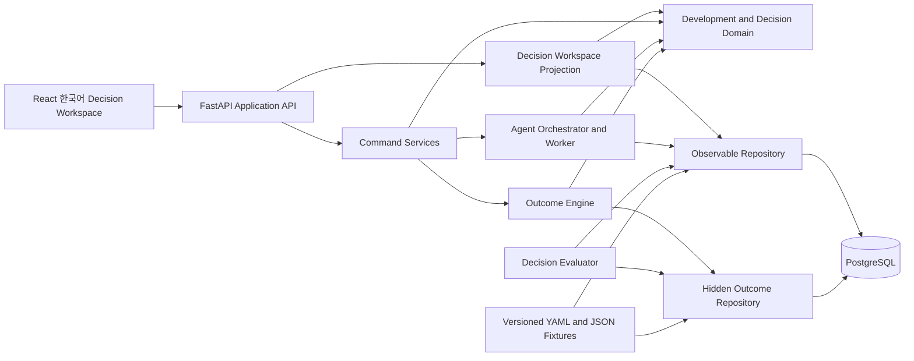
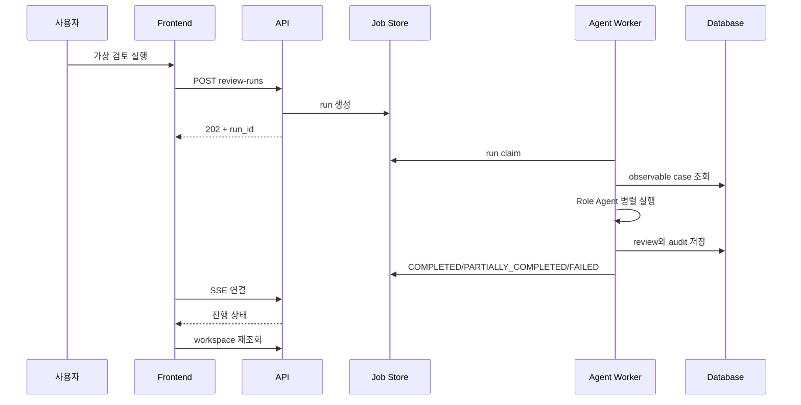

# SoC Operational Decision Twin Backend·Frontend·UX 기술 설계

> 문서 상태: Supporting Technical Design v0.3
>
> 작성일: 2026-07-11 / 최종 구현 동기화: 2026-07-27
>
> 적용 범위: 집에서 synthetic fixture로 구현하는 Role Agent 기반 PoC
>
> 상위 실행 계획: `docs/readiness/01_MASTER_EXECUTION_PLAN.md`
>
> 세부 실행 계약: `docs/readiness/02_UI_PERSONA_AND_APPROVAL_BOUNDARY.md` ~ `08_CANONICAL_TERMS_AND_API_CONTRACT.md`
>
> 문서 역할: Backend/Frontend 구현 예시를 제공하며 canonical contract를 변경하지 않음

## 0. 최신 구현 기준과 문서 분리

이 문서의 Backend/Frontend/UX 원칙은 계속 유효하지만, 2026-07-27 현재 실제 구현은 I0~I7,
Step 5 B2 runtime, UX-A~K, OPS-A~F와 ENT-A~F까지 진행됐다. 초기 예시가 실제 contract와
다를 경우 다음 순서의 문서를 우선한다.

1. `docs/readiness/08_CANONICAL_TERMS_AND_API_CONTRACT.md`
2. 승인된 `docs/decisions/ADR-*.md`
3. `docs/readiness/01_MASTER_EXECUTION_PLAN.md`
4. 이 supporting design

Enterprise source preparation, mapping, sync, dry-run, security/operation emulator와 사내
handoff의 최신 상세 설계는
`internal_docs/26.07.27 ENT-A~F Enterprise Preparation 및 Handoff 상세 설계.md`가 소유한다.
현재 Enterprise Preparation은 Frontend/API/live connector를 추가하지 않으며, 검토되지 않은
source data가 Project/Decision projection이나 Role Agent packet으로 직접 들어가지 않는다.

## 1. 문서 목적

이 문서는 넓은 SoC Operational Ontology를 사용자가 이해할 수 있는 제품으로 만들기 위한 Backend, Frontend, UX의 기술 구조를 정의한다.

Backend의 목적은 Ontology 객체를 그대로 API로 노출하는 것이 아니다. 사용자가 내려야 할 결정에 필요한 상황, 선택지, 의견 충돌, 권고, 안전 조건을 하나의 화면용 read model로 조립해야 한다.

Frontend의 목적도 많은 데이터를 시각화하는 것이 아니다. 사용자가 다음 질문에 빠르게 답하도록 해야 한다.

1. 지금 무엇을 결정해야 하는가?
2. 왜 지금 결정해야 하는가?
3. 개발은 어디까지 진행됐고 무엇이 막혀 있는가?
4. 선택지별 효과·위험·되돌리기 가능성은 무엇인가?
5. Role Agent들은 어디서 동의하고 어디서 충돌하는가?
6. 어떤 조건과 guardrail로 진행해야 하는가?
7. 결정 이후 실제 simulated outcome은 어땠는가?

---

## 2. 핵심 설계 결정

### 2.1 사용자 작업 중심 API

Frontend가 `Project`, `Scenario`, `WorkItem`, `Evidence`, `RoleReview` API를 각각 호출해 화면을 조립하지 않는다.

Backend가 `DecisionWorkspaceProjection`을 만들고 Frontend는 이를 표시한다.

```text
나쁜 구조:
Frontend
  → Project API
  → Scenario API
  → Evidence API
  → Role API
  → Decision API
  → Frontend에서 join/판단

권장 구조:
Frontend
  → GET /api/v1/decision-cases/{id}/workspace
  → 화면 목적에 맞게 조립된 단일 read model
```

### 2.2 Domain Core와 Agent Runtime 분리

Development state, ontology relation, decision state transition은 LLM 없이 동작해야 한다.

```text
Domain Core:
  deterministic
  schema validated
  unit test 가능

Agent Runtime:
  provider dependent
  비동기 실행
  실패·재시도 가능
  output은 candidate advice
```

Agent가 실패해도 저장된 development state와 기존 decision 결과를 읽을 수 있어야 한다.

### 2.3 Observable과 Hidden의 물리적 분리

Role Agent와 Decision Chair가 읽는 repository는 observable data만 제공한다. Hidden outcome은 별도 port와 table/schema를 통해 Outcome Engine과 Evaluator만 접근한다. Runtime database role에는 hidden schema 조회 권한을 주지 않고 Outcome/Evaluation connection만 별도 role을 사용한다.

컴파일 수준의 완전한 보안 경계는 아니더라도 application dependency 방향으로 accidental leakage를 막는다.

### 2.4 긴 Agent 작업은 비동기 처리

Role review, Challenger, Decision Chair 실행은 HTTP request 안에서 끝날 것을 기대하지 않는다.

```text
POST command
  → 202 Accepted + run_id
  → worker 실행
  → run status/event 저장
  → UI는 SSE로 진행 표시, 연결 실패 시 polling fallback
```

FastAPI의 간단한 background task 기능은 짧은 후처리에는 사용할 수 있지만, 여러 Agent 호출·재시도·복구가 필요한 핵심 workflow는 별도 worker와 durable run record로 처리한다.

### 2.5 Frontend에는 업무 규칙을 두지 않음

다음 판단을 Frontend에서 계산하지 않는다.

- decision readiness
- reversibility 등급
- risk scenario
- Role 합의/충돌
- guardrail completeness
- rollback trigger 유효성
- outcome evaluation

Frontend는 Backend가 제공한 상태와 허용 action을 표시하고 사용자 입력을 command로 보낸다.

### 2.6 한국어 우선, 기술 상세는 점진 노출

사용자용 label과 설명은 한국어가 기본이다. Raw ontology ID, JSON, source metadata, Agent prompt는 개발자 상세 화면으로 분리한다.

### 2.7 Graph는 기본 화면이 아님

Ontology graph는 관계 디버깅에는 유용하지만 첫 화면의 핵심 UI가 아니다. 기본 화면에서는 결정·진행·선택지를 표와 요약으로 보여주고, 관계 graph는 상세 보기에서만 제공한다.

---

## 3. 전체 기술 아키텍처



### 3.1 Dependency 방향

```text
domain
  ↑
application
  ↑
api / worker / cli

infrastructure
  → domain/application port 구현
```

금지:

- Domain model이 FastAPI를 import
- Domain model이 PostgreSQL row를 직접 사용
- Frontend가 hidden outcome endpoint 호출
- Agent prompt가 DB query 수행
- API route 안에 decision rule 구현

---

## 4. 권장 기술 스택

### 4.1 Backend

|영역|선택|용도|
|---|---|---|
|Language|Python 3.11+|Domain, Agent orchestration, evaluation|
|API|FastAPI|REST/OpenAPI, typed request/response|
|Contract|Pydantic v2 + JSON Schema|Fixture, domain, Agent output validation|
|DB|PostgreSQL|runtime state, relation, event, transaction, JSONB payload|
|DB mapping|SQLAlchemy|repository 구현과 transaction 관리|
|Migration|Alembic|schema version 관리|
|Test|pytest|unit, contract, integration, evaluation|
|Fixture|YAML/JSON|사람이 검토 가능한 synthetic source|

### 4.2 Frontend

|영역|선택|용도|
|---|---|---|
|Framework|React 19 + TypeScript|상태가 많은 Decision Workspace|
|Build|Vite 8|로컬 SPA 개발과 production build|
|Routing|React Router 8 declarative SPA mode|3개 route와 case deep-link|
|Server state|TanStack Query|API fetch, cache, invalidation과 refetch|
|Style|CSS variables + component-scoped styles|한국어 UI design token과 layout|
|Test|Vitest 4 + React Testing Library + user-event|사용자 행동 중심 component test|
|E2E|Playwright|전체 decision flow 검증|

Vite는 TypeScript를 transpile하지만 type checking 자체를 대신하지 않으므로 별도 `tsc --noEmit` 또는 동등한 type-check 명령을 CI에 포함한다.

### 4.3 초기에는 도입하지 않을 것

- Graph DB
- 별도 Vector DB
- Redis/Celery를 전제로 한 대형 queue
- Microservice 분리
- Next.js/SSR
- 범용 workflow engine
- 복잡한 global Frontend state manager
- 대형 chart framework
- 실시간 양방향 WebSocket

필요성이 확인되기 전에는 Backend API, worker, PostgreSQL, SPA의 단일 deployable 구조를 유지한다.

---

## 5. Backend 모듈 구조

```text
backend/
├─ src/soc_ot/
│  ├─ domain/
│  │  ├─ development/
│  │  ├─ ontology/
│  │  ├─ decisions/
│  │  ├─ outcomes/
│  │  └─ evaluation/
│  ├─ application/
│  │  ├─ commands/
│  │  ├─ queries/
│  │  ├─ projections/
│  │  └─ ports/
│  ├─ agents/
│  │  ├─ contracts/
│  │  ├─ roles/
│  │  ├─ routing/
│  │  ├─ challenge/
│  │  ├─ chair/
│  │  └─ orchestration/
│  ├─ infrastructure/
│  │  ├─ fixtures/
│  │  ├─ postgres/
│  │  ├─ llm/
│  │  └─ jobs/
│  ├─ api/
│  │  ├─ routes/
│  │  ├─ schemas/
│  │  ├─ dependencies/
│  │  └─ errors/
│  ├─ worker/
│  └─ cli/
└─ tests/
```

Python package metadata는 repository root의 단일 `pyproject.toml`에서 관리하고 package source를 `backend/src`로 지정한다.

### 5.1 Domain

책임:

- Development Track/WorkItem 상태 전이
- dependency와 milestone 규칙
- Decision Case 상태 전이
- observable/hidden type 분리
- guardrail/trigger/action/outcome 모델
- Process/Outcome evaluation 모델

Domain에는 다음이 없어야 한다.

- HTTP
- DB session
- LLM SDK
- UI label
- provider-specific error

### 5.2 Application

책임:

- use case orchestration
- transaction boundary
- repository port 호출
- command validation
- projection 생성
- allowed action 계산

주요 service:

```text
GetDecisionList
GetDecisionWorkspace
StartRoleReview
BuildDecisionDossier
RunDecisionChair
AdvanceOutcome
EvaluateDecision
ValidateFixture
```

### 5.3 Agent Runtime

책임:

- Agent Router
- 독립 Role review 실행
- prompt/model version 기록
- structured output parse/validation
- Challenger와 bounded revision
- Decision Chair 실행
- replay/live provider 전환

Agent Runtime은 Domain object를 직접 수정하지 않는다. Output을 application command로 반환하고 application layer가 validation 후 저장한다.

### 5.4 Infrastructure

책임:

- YAML/JSON fixture repository
- PostgreSQL repository
- LLM provider adapter
- durable job/run store
- clock/ID generator
- audit log

---

## 6. 저장 구조

### 6.1 Source와 Runtime 분리

```text
Versioned Fixture Source:
  fixtures/**/*.yaml
  contracts/**/*.json

Runtime State:
  PostgreSQL

Generated Projection/Export:
  output/ 또는 DB projection
```

Fixture가 바뀌었다고 runtime decision history를 자동 덮어쓰지 않는다. Fixture version과 import run을 기록한다.

### 6.2 논리 table group

아래 목록은 최종 논리 group 후보다. I2에서 모든 table을 한 번에 만들지 않는다.

#### Development

```text
projects
development_tracks
work_items
deliverables
dependencies
milestones
development_events
resource_constraints
```

#### Technical/Ontology

```text
scenarios
variants
components
kpis
issues
tests
evidence
ontology_relations
aliases
```

#### Decision

```text
decision_cases
decision_windows
alternatives
assumptions
uncertainties
risk_scenarios
guardrails
triggers
decisions
actions
```

#### Agent

```text
agent_runs
agent_run_steps
role_reviews
challenger_reviews
decision_dossiers
prompt_versions
provider_metadata
```

#### Outcome/Evaluation

```text
hidden_outcome_cases
outcome_events
outcome_results
decision_evaluations
```

#### Operations

```text
fixture_import_runs
audit_events
workspace_projections
```

I2의 최소 physical schema는 fixture import, project/track/work/dependency, decision case/alternative/evidence/relation, append event에 필요한 table부터 시작한다. Agent table은 I4, Dossier/Decision table은 I5, hidden Outcome/Evaluation table은 I6 migration에서 추가한다. 새로운 table은 현재 I 단계의 query, invariant 또는 retention 경계를 입증할 때만 추가한다.

### 6.3 JSONB 사용 원칙

정형적으로 조회·연결해야 하는 ID, status, time, owner, type은 일반 column으로 둔다.

변화가 잦거나 provider별 차이가 큰 payload만 JSONB로 둔다.

JSONB 후보:

- retention 기간이 적용된 redacted provider response
- normalized structured Agent output와 atomic claim
- provider metadata
- option impact dimension
- evaluation breakdown

JSONB에 모든 ontology를 한 덩어리로 저장하지 않는다.

### 6.4 Event와 현재 상태

완전한 Event Sourcing을 처음부터 도입하지 않는다.

다음 두 구조를 병행한다.

```text
Current State Table:
  빠른 UI 조회

Append-only Domain Event:
  상태 전이, as-of 재구성, audit
```

Command가 상태를 바꿀 때 current row와 event를 같은 transaction에서 기록한다.

### 6.5 동시성

- `decision_cases.aggregate_version`을 이용한 optimistic concurrency
- decision command는 expected version 포함
- 중복 command 방지를 위한 idempotency key
- 이미 끝난 run에 대한 재실행은 새 run ID와 parent run ID 기록
- Decision과 Action 생성은 하나의 transaction

---

## 7. Backend Read Model

### 7.1 DecisionWorkspaceProjection

Frontend가 가장 많이 사용하는 핵심 응답이다.

```yaml
decision_workspace:
  projection_schema_version: decision-workspace.v1
  generated_at: ""
  fixture_version: 4
  projection_source_versions:
    decision_case: 3
    dossier: 2
    decision: 1
    outcome: 0

  header:
    case_id: CASE-VR-001
    title: "UHD60 EIS 기능 조건부 포함 검토"
    status: DECISION_REQUIRED
    workspace_phase: DECISION_REQUIRED
    decision_deadline: "M2 Architecture Freeze 이전"
    simulated: true

  situation_summary:
    one_line: "Bandwidth 실측은 없지만 SW 방식은 되돌릴 수 있고 결정 기한이 임박했습니다."
    key_points: []
    stale: false

  development_progress:
    tracks: []
    blockers: []
    critical_dependencies: []
    next_milestone: {}

  alternatives:
    items: []
    comparison_dimensions:
      - 효과
      - 일정
      - 위험
      - 되돌리기
      - 필요한 조건

  role_alignment:
    agreed: []
    disputed: []
    needs_confirmation: []

  recommendation:
    decision_type: APPROVE_WITH_GUARDRAILS
    summary: ""
    rationale: []
    residual_risks: []

  safeguards:
    guardrails: []
    rollback_triggers: []
    required_actions: []
    verification_plan: []

  evidence_summary:
    usable_count: 0
    partial_count: 0
    missing_count: 0
    assumptions: []

  outcome:
    available: false
    summary: null
    evaluation: null

  workflow:
    phase: DOSSIER_READY
    completed_steps: []
    allowed_actions: []
```

### 7.2 Projection 생성 원칙

- 최대 5개의 key point만 기본 제공
- Role review 전체 text를 기본 응답에 넣지 않음
- agreed/disputed/needs-confirmation으로 요약
- source reference는 detail link로 제공
- raw reasoning은 technical details endpoint로 분리
- projection이 오래되면 `stale=true`와 원인을 표시

### 7.3 상세 Projection

필요 시 별도 endpoint로 읽는다.

```text
DevelopmentTimelineProjection
EvidenceDetailProjection
RoleReviewDetailProjection
OntologyRelationProjection
AgentRunTraceProjection
DecisionEvaluationProjection
```

---

## 8. API 설계

### 8.1 사용자용 Query API

```text
GET /api/v1/decision-cases
GET /api/v1/decision-cases/{case_id}/workspace
GET /api/v1/decision-cases/{case_id}/timeline
GET /api/v1/decision-cases/{case_id}/evidence
GET /api/v1/decision-cases/{case_id}/evaluation
```

Decision list query는 초기에는 다음 filter만 지원한다.

```text
status
deadline_state
decision_type
search
```

Ontology object type별 복잡한 filter는 개발자 API로 분리한다.

### 8.2 사용자용 Command API

```text
POST /api/v1/decision-cases/{case_id}/review-runs
POST /api/v1/decision-cases/{case_id}/simulated-decisions
POST /api/v1/decision-cases/{case_id}/outcome-advances
POST /api/v1/decision-cases/{case_id}/evaluations
```

Command 응답:

```json
{
  "run_id": "RUN-001",
  "status": "QUEUED",
  "status_url": "/api/v1/runs/RUN-001",
  "events_url": "/api/v1/runs/RUN-001/events"
}
```

### 8.3 Run API

```text
GET  /api/v1/runs/{run_id}
GET  /api/v1/runs/{run_id}/events
POST /api/v1/runs/{run_id}/cancel
POST /api/v1/runs/{run_id}/retry
```

Run status:

```text
QUEUED
RUNNING
PARTIALLY_COMPLETED
COMPLETED
FAILED
CANCELLED
```

Role Agent 일부가 실패해도 전체 run을 무조건 실패시키지 않는다. 필수 Role의 실패인지, 선택 Role의 실패인지 구분해 `PARTIALLY_COMPLETED`를 허용한다.

### 8.4 개발자용 API

```text
POST /api/v1/dev/fixtures/validate
POST /api/v1/dev/fixtures/import
GET  /api/v1/dev/fixtures/{case_id}/observable
GET  /api/v1/dev/runs/{run_id}/trace
GET  /api/v1/dev/contracts
```

Hidden fixture는 개발자용 API에도 노출하지 않는다. 명시적으로 `SOC_OT_AUTHORING_MODE=1`을 설정한 로컬 CLI만 사용할 수 있으며, 세부 경계는 `docs/readiness/05_AGENT_RUNTIME_AND_SECURITY_POLICY.md`를 따른다.

### 8.5 Error Contract

```json
{
  "code": "CASE_VERSION_CONFLICT",
  "message_ko": "다른 작업에서 결정 상태가 변경되었습니다. 최신 내용을 다시 불러오세요.",
  "details": {},
  "trace_id": "TRACE-001",
  "retryable": true
}
```

규칙:

- 사용자 문구는 한국어
- 개발자용 code는 안정적인 영문 enum
- provider raw error는 사용자에게 직접 노출하지 않음
- retry 가능 여부 명시
- field validation error는 화면 field와 연결 가능한 path 제공

### 8.6 OpenAPI와 Frontend type

- Backend OpenAPI를 계약 기준으로 사용
- Frontend API type/client를 자동 생성하거나 동등한 contract test 사용
- Frontend가 수동으로 duplicate interface를 관리하지 않음
- OpenAPI breaking diff를 CI에서 검사
- API contract version과 projection version을 분리
- Backend는 stable enum을 반환하고 Frontend가 static 한국어 label을 소유
- Backend는 dynamic domain explanation과 error의 한국어 문장을 제공
- Frontend contract test는 모든 공개 enum에 한국어 label이 있는지 검사

---

## 9. 비동기 Agent 실행 설계

### 9.1 실행 흐름



### 9.2 Worker 전략

초기:

- 별도 Python worker process
- PostgreSQL `agent_runs` 기반 claim
- `FOR UPDATE SKIP LOCKED` query 기반 lease claim
- run step별 checkpoint
- `lease_owner`, `lease_expires_at`, `heartbeat_at`, `attempt_no`, `next_retry_at`, `cancel_requested_at`

나중:

- 처리량과 장애 복구 필요성이 커질 때 전용 queue 검토

### 9.3 Role 실행

- Round 1 Role Agent는 병렬 실행 가능
- 다른 Agent의 1차 output을 input에 포함하지 않음
- Challenger는 Round 1 종료 후 실행
- bounded revision은 필요한 Role만 재실행
- Decision Chair는 Dossier 완료 후 실행

### 9.4 Timeout과 Retry

```text
Role call timeout
  → 동일 provider 1회 제한 retry
  → 여전히 실패하면 role_failed
  → 필수 Role 여부에 따라 partial/fail 판단
```

Retry 시 같은 idempotency key를 사용해 중복 review 저장을 막는다.

### 9.5 Replay와 Live

```text
Replay Mode:
  저장된 provider response 사용
  UI/API/평가 회귀 test

Live Mode:
  실제 LLM 호출
  model/prompt/parameter 기록
  run 간 차이 비교
```

UI는 Replay인지 Live인지 명확히 표시한다.

### 9.6 진행 상태 전달

MVP는 Server-Sent Events를 기본으로 사용한다.

```text
GET /api/v1/runs/{run_id}/events
Content-Type: text/event-stream
```

이 연결은 `run_started`, `role_started`, `role_completed`, `role_failed`, `dossier_completed`, `run_completed` event를 전달한다. 연결이 끊기거나 SSE를 사용할 수 없으면 `GET /api/v1/runs/{run_id}` polling으로 전환한다. 양방향 통신이 필요하지 않으므로 WebSocket은 도입하지 않는다.

---

## 10. Frontend 정보 구조

### 10.1 Route

```text
/decisions
/decisions/:caseId
/dev/fixtures
```

MVP에서는 별도 route를 만들지 않는다.

금지 route 예:

```text
/roles/:roleId
/ontology/all
/risks/dashboard
/portfolio
/weekly
/agents/chat
```

### 10.2 화면 1: 결정 목록

사용자 목적:

- 지금 확인해야 할 결정을 찾는다.
- 기한과 상태를 비교한다.

기본 표시:

|표시|설명|
|---|---|
|결정 제목|기술 객체가 아닌 업무 질문|
|현재 단계|검토 전, Agent 검토 중, 결정 필요, 실행 중, 결과 확인|
|결정 기한|절대 시각 또는 milestone|
|다음 행동|사용자가 지금 할 일|
|권고|조건부 진행, 시험, 연기 등|
|남은 위험|한 줄 요약|

초기 filter:

- 진행 상태
- 결정 기한
- 권고 유형
- 제목 검색

### 10.3 화면 2: Decision Workspace

```text
┌──────────────────────────────────────────────────────────────┐
│ UHD60 EIS 기능 조건부 포함 검토     결정 필요 · M2 이전      │
│ Synthetic Case · Live/Replay 표시                            │
├──────────────────────────────────────────────────────────────┤
│ 권고: 조건부 진행                                            │
│ 핵심 이유 3개 · 남은 위험 2개 · [다음 행동]                 │
├───────────────────────────────────┬──────────────────────────┤
│ 현재 개발 상황                   │ 안전하게 진행하려면      │
│ Track 진행 / blocker / dependency│ guardrail / trigger      │
├───────────────────────────────────┼──────────────────────────┤
│ 선택지 비교                       │ Agent 의견               │
│ 효과·일정·위험·되돌리기          │ 일치·충돌·확인 필요      │
├───────────────────────────────────┴──────────────────────────┤
│ 결정 과정 / 결과 / 평가                                     │
├──────────────────────────────────────────────────────────────┤
│ 상세 보기: 근거 · 가정 · Timeline · Ontology · Run Trace    │
└──────────────────────────────────────────────────────────────┘
```

넓은 화면에서도 2-column을 넘지 않는다. 좁은 화면에서는 오른쪽 영역을 아래로 이동한다.

### 10.4 화면 3: 개발자 Fixture/평가

목적:

- fixture와 contract 검증
- hidden leakage 검사
- Agent run trace 확인
- evaluation 상세 비교

일반 사용자는 이 화면을 사용하지 않는다.

---

## 11. Decision Workspace 구성요소

### 11.1 Decision Header

표시:

- 결정 질문
- 현재 workflow 단계
- 결정 기한
- simulated 표시
- projection freshness

하지 않을 것:

- 내부 Case ID를 큰 제목으로 표시
- 모든 project metadata 나열
- 여러 action button 동시 강조

### 11.2 Recommendation Summary

최대 다음만 표시한다.

- 권고 유형
- 한 문장 이유
- 핵심 조건 최대 3개
- 남은 위험 최대 2개
- 현재 primary action

예:

```text
권고: 조건부 진행

SW feature flag로 되돌릴 수 있고 결정 기한이 임박했으므로 제한적으로 진행합니다.

조건
1. DDR bandwidth가 기준을 넘으면 EIS를 비활성화합니다.
2. UHD60 sustained thermal test를 M3 전에 수행합니다.
3. HW carry-over option은 확정하지 않고 보존합니다.
```

### 11.3 Development Progress

표 형태의 track summary를 기본으로 사용한다.

|개발 Track|상태|현재 작업|Blocker|다음 기준점|
|---|---|---|---|---|
|Architecture|검토 중|Option 비교|BW 실측 없음|M2 Freeze|
|HW|대기|Carry-over 검토|Architecture 결정|RTL Window|
|SW|진행 중|Feature flag|Interface 임시|Integration Build|
|Verification|준비 중|측정 계획|장비 slot|Thermal Test|

복잡한 dependency graph는 펼쳐보기로 제공한다.

### 11.4 Alternative Comparison

Row는 선택지, column은 사용자가 실제 비교하는 dimension으로 고정한다.

```text
효과
일정
기술 위험
되돌리기
필요한 근거
Guardrail
잔여 위험
```

정확하지 않은 숫자 score로 전체 순위를 만들지 않는다.

### 11.5 Role Alignment

Role별 긴 card를 나열하지 않는다.

```text
의견 일치
  - SW 방식은 되돌릴 수 있음
  - BW 확인이 필요함

의견 충돌
  - Architecture: 현재 단계에서 option 보존 필요
  - Program: 일정상 이번 단계에서 방향 결정 필요

확인 필요
  - Verification 장비 slot 확보 가능 여부
```

Role 원문은 펼쳐보기에서 확인한다.

### 11.6 Safeguards

Guardrail과 rollback trigger를 구분한다.

```text
Guardrail:
  진행 중 반드시 지켜야 하는 조건

Rollback Trigger:
  조건을 위반하면 중단·철회·재검토하는 관측 기준
```

각 item은 owner, due/milestone, verification method를 가진다.

### 11.7 Outcome/Evaluation

결정 직후에는 `결과 대기`를 표시한다.

Outcome이 진행되면 다음을 분리한다.

- 실제 simulated result
- decision process 평가
- outcome 평가
- hindsight bias 설명
- 다음 case에 재사용할 lesson

---

## 12. Frontend 컴포넌트 구조

```text
frontend/src/
├─ app/
│  ├─ AppShell.tsx
│  ├─ routes.tsx
│  └─ providers.tsx
├─ features/
│  ├─ decision-list/
│  ├─ decision-workspace/
│  │  ├─ DecisionHeader.tsx
│  │  ├─ RecommendationSummary.tsx
│  │  ├─ DevelopmentProgress.tsx
│  │  ├─ AlternativeComparison.tsx
│  │  ├─ RoleAlignment.tsx
│  │  ├─ SafeguardPanel.tsx
│  │  ├─ OutcomeEvaluation.tsx
│  │  └─ DetailDrawer.tsx
│  ├─ agent-runs/
│  └─ fixture-devtools/
├─ api/
│  ├─ generated/
│  └─ client.ts
├─ components/
│  ├─ status/
│  ├─ feedback/
│  ├─ layout/
│  └─ data-display/
├─ design/
│  ├─ tokens.css
│  └─ statusLabels.ko.ts
└─ test/
```

### 12.1 Feature ownership

각 feature는 다음을 가진다.

```text
components
hooks
view model mapper
tests
```

Domain-wide 거대한 `components/` 폴더에 모든 UI를 섞지 않는다.

### 12.2 State 분리

```text
Server State:
  decision workspace
  run status
  evaluation

Route State:
  caseId
  selected detail section

Local UI State:
  drawer open
  expanded item
  filter input
```

Decision data를 global client store의 source of truth로 만들지 않는다.

### 12.3 View Model

Backend projection과 UI component 사이에 작은 mapper만 둔다.

허용:

- 날짜 한국어 formatting
- display label mapping
- grouping/presentation order

금지:

- risk 계산
- Role 합의 판단
- allowed action 결정
- evidence confidence 계산

---

## 13. UX 상태와 오류 처리

### 13.1 Loading

- 전체 blank spinner 대신 section skeleton
- 기존 projection이 있으면 유지하고 `업데이트 중` 표시
- Agent run 중에도 이전 결과를 볼 수 있음

### 13.2 Empty

```text
나쁜 문구:
  No data

권장 문구:
  아직 가상 검토를 실행하지 않았습니다.
  역할별 검토를 실행하면 선택지와 쟁점이 여기에 표시됩니다.
```

### 13.3 Partial Agent Failure

```text
일부 검토를 완료하지 못했습니다.

완료: Architecture, Verification, Program
실패: SW

현재 결과로 계속 보거나 SW 검토만 다시 실행할 수 있습니다.
```

필수 Role 실패 시 Chair 실행 가능 여부는 Backend allowed action으로 결정한다.

### 13.4 Stale

Decision Workspace projection이 최신 case version과 다르면:

- 상단에 `새로운 개발 이벤트가 반영되지 않았습니다` 표시
- 결정 command 비활성화
- `최신 상태 불러오기`를 primary action으로 제공

### 13.5 Conflict

다른 run이나 command로 case version이 바뀌면 사용자 입력을 버리지 않고 최신 projection과 충돌 내용을 보여준다.

### 13.6 Long Text

- 첫 문단은 결론
- 근거는 bullet
- 원문은 상세 보기
- ellipsis에만 의존하지 않음
- tooltip을 필수 정보 전달 수단으로 사용하지 않음

---

## 14. 한국어 UI 표준

### 14.1 Case와 decision Label

|종류|Backend enum|한국어|
|---|---|---|
|DecisionCaseStatus|DRAFT|초안|
|DecisionCaseStatus|CONTEXT_BUILDING|상황 정리 중|
|DecisionCaseStatus|OPTIONS_READY|선택지 준비|
|DecisionCaseStatus|DECISION_REQUIRED|결정 필요|
|DecisionCaseStatus|DECIDED|판단 완료|
|DecisionCaseStatus|ACTIONING|실행 중|
|DecisionCaseStatus|VERIFIED|검증 완료|
|DecisionCaseStatus|CLOSED|종료|
|DecisionType|APPROVE|진행 승인|
|DecisionType|APPROVE_WITH_GUARDRAILS|조건부 진행|
|DecisionType|RUN_REVERSIBLE_TRIAL|가역적 시험|
|DecisionType|COLLECT_MINIMUM_EVIDENCE|최소 근거 확보|
|DecisionType|DEFER_UNTIL_TRIGGER|조건 충족까지 연기|
|DecisionType|REJECT|진행하지 않음|
|DecisionType|ESCALATE|상위 검토 필요|

### 14.2 Agent 실행 Label

|Backend enum|한국어|
|---|---|
|QUEUED|실행 대기|
|RUNNING|검토 중|
|PARTIALLY_COMPLETED|일부 완료|
|COMPLETED|완료|
|FAILED|실패|
|CANCELLED|취소|

### 14.3 표현 원칙

- `confidence`는 단순히 `신뢰도`로만 표시하지 않고 근거 수준을 함께 표시
- `risk`는 `위험 높음`에서 끝내지 않고 원인과 action 표시
- `evidence missing`은 `자료 없음`보다 `아직 확인할 수 없음`, `측정 예정`, `연결 누락`으로 구분
- `defer`는 `보류`보다 `어떤 조건까지 연기`인지 표시
- `simulation`은 `가상 판단`, `가상 결과`로 명확히 표시
- Backend enum은 영문으로 유지하고 Frontend의 `statusLabels.ko.ts`가 정적 label을 관리
- Agent의 user-facing summary/rationale는 한국어로 생성·검증한다. 개발자 진단에는 retention 기간 안의 redacted provider response만 사용하고 private chain-of-thought는 요청·저장·표시하지 않는다.

---

## 15. 접근성·사용성

- 색상만으로 상태 표현 금지
- 모든 icon에 text 또는 접근 가능한 label 제공
- keyboard로 주요 action 수행 가능
- focus state 명확히 표시
- table header와 관계 명확히 지정
- drawer/dialog focus 이동과 복귀 처리
- motion은 정보 이해를 돕는 수준으로 제한
- 긴 Agent 결과는 heading과 list로 구조화
- 날짜·시간·숫자는 한국 locale로 formatting
- 사용자가 hover하지 않아도 핵심 정보를 볼 수 있어야 함

### 15.1 사용성 Acceptance Task

Fixture 사용자 test에서 다음 task를 수행한다.

1. 결정 질문 찾기
2. 결정 기한 찾기
3. 가장 큰 blocker 찾기
4. 의견 충돌 하나 설명하기
5. 권고와 guardrail 설명하기
6. rollback trigger 찾기
7. 다음 action 선택하기
8. Process Quality와 Outcome Quality 차이 설명하기

목표 시간은 초기 가설로 기록하고 실제 사용성 test에서 보정한다. 임의의 숫자를 business proof로 사용하지 않는다.

---

## 16. Performance와 Freshness 목표

초기 로컬 목표이며 warm PostgreSQL, frozen 8-case corpus, 단일 사용자, 동일 Windows host에서 측정한다. 각 report는 hardware, dataset hash, cold/warm 여부와 30회 이상 측정의 p50/p95를 기록한다.

|항목|목표|
|---|---|
|Decision list API|p95 300ms 이하|
|Workspace projection API|p95 500ms 이하|
|Command 접수|1초 이내 202 반환|
|Run status 표시|완료 후 2초 이내 UI 반영|
|클릭 후 visual feedback|100 ms 이내|
|200 ms를 넘는 fetch|loading state 표시|

성능을 위해 전체 evidence, Agent raw output, ontology graph를 workspace 최초 응답에 포함하지 않는다.

Projection cache key:

```text
case_id + fixture_version + decision_case.aggregate_version
+ dossier.aggregate_version + decision.aggregate_version + outcome.aggregate_version
```

---

## 17. Observability와 Audit

모든 log에 가능한 경우 다음 context를 포함한다.

```text
trace_id
case_id
fixture_version
aggregate_version
projection_schema_version
run_id
run_step_id
role_id
prompt_bundle_version
model/provider
decision_id
outcome_run_id
```

측정:

- API latency/error
- Agent role별 latency/failure/retry
- token/cost telemetry
- parse/validation failure
- projection build latency
- stale projection count
- user command count
- allowed action violation

Audit event는 append-only로 기록한다.

```text
fixture imported
role review started/completed/failed
dossier built
simulated decision created
outcome advanced
evaluation generated
projection invalidated
```

---

## 18. 테스트 전략

### 18.1 Backend Unit

- 상태 전이
- dependency/cycle
- decision policy constraint
- observable/hidden boundary
- projection summary limit
- allowed action
- Korean status label completeness

### 18.2 Contract

- Pydantic ↔ JSON Schema
- OpenAPI snapshot
- Frontend generated type compatibility
- error response
- Agent output schema
- projection version

### 18.3 Backend Integration

- PostgreSQL repository parity
- migration up/down policy
- transaction rollback
- optimistic concurrency
- idempotency
- worker claim/retry/recovery

### 18.4 Agent Evaluation

- unsupported claim
- role boundary
- role differentiation
- hidden leakage
- dissent preservation
- Decision Chair policy compliance
- replay determinism
- live multi-run stability

### 18.5 Frontend Component

- 한국어 label
- allowed action만 표시
- loading/empty/error/partial/stale
- Role conflict 표시
- guardrail/trigger 구분
- raw detail 기본 숨김
- keyboard/accessibility

### 18.6 E2E 핵심 Flow

#### Flow A. 조건부 진행

```text
결정 목록
→ Workspace
→ Role Review 실행
→ Dossier 확인
→ Decision Chair 실행
→ 조건부 진행과 guardrail 확인
→ Outcome 진행
→ 평가 확인
```

#### Flow B. 비가역적 변경 연기

```text
Data 부족 + 비가역 option
→ DEFER/COLLECT EVIDENCE
→ 연기 조건과 최소 실험 확인
```

#### Flow C. Partial Failure

```text
SW Agent 실패
→ partial 상태 표시
→ SW만 retry
→ Workspace projection 갱신
```

---

## 19. 구현 단계

## I0 지원. UX Contract와 scaffold

작업:

- 사용자 질문 7개 확정
- Decision Workspace projection 초안
- 한국어 status/glossary
- desktop/mobile wireframe
- primary action state map

Gate:

- Backend 없이 fixture JSON으로 화면을 설명할 수 있다.
- 화면의 모든 section이 사용자 질문과 연결된다.

## I1 지원. Backend Domain과 CASE-VR-001

작업:

- package scaffold
- Pydantic domain
- fixture repository
- read-only list/workspace API
- structured error
- OpenAPI

Gate:

- CASE-VR-001의 workspace projection을 API로 반환한다.
- hidden data가 응답에 없다.

## I2 지원. PostgreSQL Runtime와 Read Projection

작업:

- migration
- PostgreSQL repository와 in-memory repository parity
- event/current-state atomic transaction
- Decision Workspace projection
- fixture import와 restart persistence

Gate:

- in-memory/fixture와 PostgreSQL 결과가 동일하다.
- API restart 후 imported case가 유지된다.
- current state와 domain event가 원자적으로 commit된다.

## I3 지원. Deterministic packet과 Read-only Frontend

작업:

- 3 route scaffold
- generated API client
- `BuildObservableCasePacket`
- evaluation corpus freeze
- 결정 목록
- Decision Workspace read-only sections
- loading/empty/error/stale state
- design token과 한국어 label

Gate:

- Agent 실행 없이 fixture 결과를 사용자가 이해할 수 있다.
- raw ontology를 보지 않고 blocker와 option을 찾을 수 있다.

## I4 지원. Agent Run Backend와 Progress UI

작업:

- PostgreSQL-backed agent_runs/job store
- worker/ReplayProvider/OpenAI adapter
- Role Review command API
- SSE 진행 상태와 polling fallback
- progress/partial failure/retry UI

Gate:

- UI request가 Agent 완료까지 block되지 않는다.
- worker restart 후 run을 복구하거나 명시적으로 안전하게 실패 처리한다.

## I5 지원. Dossier와 Decision Chair

작업:

- Challenger/Dossier service
- Decision Chair command
- optimistic concurrency
- Role agreement/disagreement UI
- recommendation/safeguard UI

Gate:

- dissent가 UI와 API에서 보존된다.
- 조건부 결정에 guardrail과 trigger가 표시된다.

## I6 지원. Outcome와 Evaluation

작업:

- hidden repository
- Outcome Engine
- outcome event/state transition
- Process/Outcome evaluation
- outcome/evaluation UI

Gate:

- 결정부터 결과·평가까지 한 화면에서 추적된다.
- hidden fixture를 HTTP로 조회할 수 없다.

## I7 지원. Hardening

작업:

- CASE-VR-001~005와 CASE-HO-001~003
- accessibility
- performance
- E2E
- multi-run Agent evaluation
- error recovery

Gate:

- 5개 development/validation case의 핵심 E2E가 통과한다.
- 3개 sealed-unseen case의 frozen evaluation path가 통과한다.
- 사용성 acceptance task를 실행할 수 있다.

---

## 20. Backend/Frontend 공통 Definition of Done

- 사용자 질문과 연결되지 않는 API/UI를 추가하지 않는다.
- UI용 aggregate read model이 존재한다.
- Frontend에 business decision rule이 없다.
- Agent 작업은 비동기 실행된다.
- observable/hidden leakage test가 있다.
- 모든 command는 idempotency와 case version을 고려한다.
- 모든 state에 loading/empty/error/stale 처리가 있다.
- 한국어 label과 설명이 있다.
- raw technical detail은 progressive disclosure로 숨겨진다.
- OpenAPI/Frontend type contract가 동기화된다.
- Backend unit/contract/integration test가 있다.
- Frontend component/E2E test가 있다.
- model/prompt/rule/fixture/projection version을 추적한다.

---

## 21. 피해야 할 구현

### Backend

- 모든 object를 generic CRUD 하나로 처리
- API route에서 ontology join과 risk 계산
- Agent 결과를 validation 없이 DB에 저장
- 긴 Agent 작업을 동기 HTTP로 실행
- 전체 decision case를 하나의 JSONB blob으로 저장
- hidden data와 observable data를 같은 repository method로 제공
- 실제 state와 projection cache를 구분하지 않음

### Frontend

- 첫 화면에 전체 ontology graph 표시
- Role Agent 수만큼 tab/card 생성
- 3개 이상의 column
- 한 화면에 여러 primary action
- raw ID와 enum 직접 표시
- 모든 정보를 tooltip에 숨김
- 색상만으로 risk 표현
- Frontend에서 confidence/risk/readiness 계산
- Agent 실행 중 전체 화면 사용 불가
- 기술 dashboard를 사용자 Decision Workspace로 착각

---

## 22. Architecture Decision Record 목록

구현 전 또는 해당 단계에서 다음 ADR을 작성한다.

```text
ADR-001 Backend package/module boundary
ADR-002 Observable/Hidden repository separation
ADR-003 PostgreSQL current state + append event strategy
ADR-004 Decision Workspace Projection API
ADR-005 Agent run worker and durability
ADR-006 Replay/Live provider boundary
ADR-007 Decision command concurrency/idempotency
ADR-008 React SPA and Korean-first UI
ADR-009 OpenAPI to Frontend type synchronization
ADR-010 UI progressive disclosure and 3-route limit
```

---

## 23. 첫 번째 기술 Milestone

첫 번째 기술 Milestone은 다음 한 흐름을 만족한다.

```text
CASE-VR-001 fixture
  → Backend workspace projection
  → 한국어 read-only Decision Workspace
  → 비동기 Role Review 실행
  → 진행 상태와 partial failure 표시
  → Dossier/Decision Chair
  → 조건부 진행과 guardrail 표시
  → Outcome 진행
  → Process/Outcome 평가 표시
```

이 Milestone에서 사용자는 다음을 raw JSON 없이 설명할 수 있어야 한다.

1. 어떤 결정을 내려야 하는가?
2. 어느 개발 Track이 무엇을 기다리는가?
3. Role Agent 의견은 어디서 충돌하는가?
4. 왜 조건부 진행 또는 연기가 권고되는가?
5. 어떤 조건에서 결정을 철회해야 하는가?
6. 실제 simulated outcome과 decision process 평가는 어떻게 다른가?

---

## 24. 참고 공식 문서

- [FastAPI Background Tasks](https://fastapi.tiangolo.com/tutorial/background-tasks/)
- [FastAPI Reference / OpenAPI](https://fastapi.tiangolo.com/reference/)
- [React TypeScript](https://react.dev/learn/typescript)
- [Vite Getting Started](https://vite.dev/guide/)
- [Vite TypeScript 동작](https://vite.dev/guide/features.html#typescript)
- [React Router declarative routing](https://reactrouter.com/start/declarative/routing)
- [TanStack React Query](https://tanstack.com/query/latest/docs/framework/react)
- [Vitest guide](https://vitest.dev/guide/)
- [React Testing Library](https://testing-library.com/docs/react-testing-library/intro/)
- [Playwright webServer](https://playwright.dev/docs/test-webserver)
- [PostgreSQL JSON/JSONB Functions](https://www.postgresql.org/docs/current/functions-json.html)
