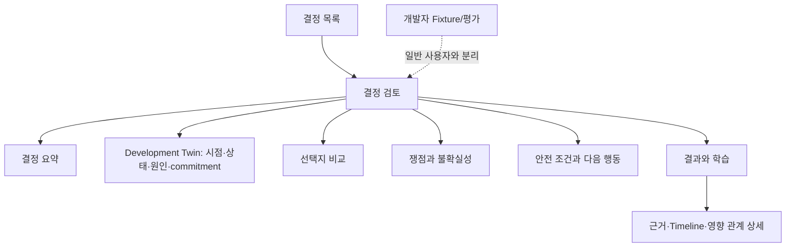

# SoC Operational Decision Twin 결정 중심 UX 설계

> 문서 상태: Supporting UX Design v1.1
> 작성일: 2026-07-16
> 적용 범위: synthetic fixture를 사용하는 로컬 PoC의 일반 사용자 UX
> Primary persona: Multimedia System/Architecture Reviewer
> Secondary persona: Technical PM/Reviewer
> Canonical authority: `PROJECT_PLAN.md`, `docs/readiness/02_UI_PERSONA_AND_APPROVAL_BOUNDARY.md`, `docs/readiness/08_CANONICAL_TERMS_AND_API_CONTRACT.md`
> 구현 주의: 이 문서는 UX 구현 방향을 상세화하며 canonical 상태·API·승인 경계를 직접 변경하지 않는다.
> v1.1 보강: 시점 재구성, 인과 전파, commitment window, 예상 상태 전이와 실제 상태 전이를 Development Twin UX의 필수 조건으로 추가

## 1. 결론

이 제품의 최선의 UX는 `SoC 상황실`, `온톨로지 탐색기`, `Agent 채팅` 중 하나가 아니다.

> **결정이 필요한 순간의 개발 상태를 빠르게 재구성하고, 불완전한 정보에서도 비교 가능한 선택지와 통제 가능한 다음 행동을 만드는 Decision Workspace다.**

사용자가 첫 화면에서 얻어야 하는 결과는 많은 정보가 아니라 다음 여섯 문장이다.

1. 지금 무엇을 결정해야 한다.
2. 이 시점까지 결정하지 않으면 어떤 개발 작업이나 milestone이 영향을 받는다.
3. 현재 권고는 무엇이며 왜 그런가.
4. 어떤 선택지가 있고 무엇을 되돌릴 수 있는가.
5. 무엇을 모르며 역할별 판단은 어디서 충돌하는가.
6. 진행한다면 무엇을 관찰하고 어떤 조건에서 멈추거나 되돌려야 한다.

따라서 로컬 PoC의 일반 사용자 화면은 다음 두 개만 사용한다.

```text
결정 목록 /decisions
  → 결정 검토 /decisions/:caseId
```

`/dev/fixtures`는 개발자 전용으로 유지한다. 상황실, 온톨로지, 이슈, 품질, Agent를 각각 최상위 메뉴로 만들지 않는다. 이들은 독립 제품이 아니라 하나의 결정에 필요한 하위 정보다.

## 2. 제품 목적에서 도출한 UX 명제

### 2.1 화면의 기본 단위는 Project가 아니라 DecisionCase다

Project dashboard는 전체 상태를 보여주지만 누가 무엇을 결정해야 하는지 흐리기 쉽다. 이 제품의 North Star는 `Situation-to-Decision Time`이므로 화면의 주어는 항상 결정 질문이어야 한다.

```text
잘못된 주어:
  Orion-X1 현황
  Camera 성능
  ISSUE-2471

권장 주어:
  측정이 완성되지 않은 상태에서 UHD60 EIS를 제한 조건으로 진행할 것인가?
```

Project, scenario, issue, IP는 결정 질문의 맥락으로만 표시한다.

### 2.2 사용자는 정보를 탐색하는 사람이 아니라 판단을 완성하는 사람이다

검색과 탐색은 보조 작업이다. 기본 흐름은 다음과 같다.

```text
발견
  무엇이 결정을 기다리는가
→ 이해
  왜 지금이며 무엇이 막혀 있는가
→ 비교
  선택지별 효과·일정·위험·가역성은 무엇인가
→ 도전
  어떤 가정과 반대 의견이 있는가
→ 통제
  guardrail, rollback, owner, verification은 무엇인가
→ 판단
  현재 정보에서 어떤 저후회 행동을 선택할 것인가
→ 관찰
  판단 후 개발 상태와 결과는 어떻게 변했는가
→ 학습
  과정과 결과 중 무엇이 좋았고 무엇을 바꿔야 하는가
```

### 2.3 데이터 충분성과 결정 가능성을 같은 값으로 표현하지 않는다

`근거 60%`, `Agent 신뢰도 96%`, `준비도 82점`과 같은 단일 점수는 실제 판단 구조를 감춘다. 기본 화면은 다음 축을 분리한다.

|축|사용자 질문|표현 예|
|---|---|---|
|결정 압력|언제까지 결정해야 하며 늦으면 무엇이 지연되는가|`M2 Freeze까지 2 step · HW 착수 대기`|
|근거 상태|무엇을 알고 무엇을 모르는가|`실측 없음 · 모델 추정과 과거 결과 사용`|
|통제 가능성|잘못되면 발견하고 되돌릴 수 있는가|`Feature flag로 즉시 철회 가능`|
|피해 범위|실패 시 영향이 어디까지 퍼지는가|`UHD60 경로 한정 · 다른 recording mode 영향 없음`|
|완화 강도|위험을 제한할 실행 조건이 있는가|`BW threshold와 rollback owner 지정`|

이 축을 Backend가 판정해 projection으로 제공하고 Frontend는 계산하지 않는다.

### 2.4 Agent는 화면의 주인공이 아니라 판단 품질을 높이는 검토 팀이다

사용자는 `Architecture Agent가 뭐라고 했는가`보다 `어떤 쟁점에서 의견이 갈렸고 내 결정에 무엇이 중요한가`를 먼저 알아야 한다.

- Agent별 긴 card를 기본으로 나열하지 않는다.
- Agent 전용 최상위 메뉴와 범용 chat을 만들지 않는다.
- 의견은 `일치`, `핵심 이견`, `확인 필요`, `반론 후 변경`으로 합친다.
- 원문과 실행 trace는 상세 보기 또는 개발자 화면에 둔다.
- Role 수, B0~B3 topology, token과 provider 비용은 일반 사용자에게 숨긴다.

### 2.5 Ontology는 탐색 화면이 아니라 설명 가능한 영향 경로다

전체 graph는 정보량은 많지만 기본 질문에 대한 답을 느리게 만든다. 기본 화면에서는 다음과 같은 짧은 영향 경로만 문장과 목록으로 보여준다.

```text
Architecture 결정 지연
  → HW interface 확정 대기
  → RTL window 2 step 감소
  → M2 Freeze 영향
```

Graph는 `영향 관계 자세히`에서 선택된 결정과 직접 관련된 depth만 표시한다. 전역 ontology graph는 개발자 도구다.

### 2.6 Digital Twin은 현재 상태 표가 아니라 시간·인과·행동을 가진 모델이다

Decision-first UX만 강조하면 제품이 잘 정리된 의사결정 문서로 보이고, 실제 개발을 재현하는 Digital Twin의 가치가 약해질 수 있다. 다음 여섯 조건을 모두 만족해야 Development Twin UX로 본다.

|조건|사용자가 확인할 수 있어야 하는 것|
|---|---|
|Stateful|선택한 step에서 각 track, WorkItem, milestone, evidence와 action의 상태|
|Temporal|현재뿐 아니라 과거 step의 당시 observable 상태와 이후 변화|
|Causal|어떤 event가 상태를 바꾸고 dependency를 통해 어디까지 영향을 전파했는지|
|Commitment-aware|각 option과 작업을 언제까지 낮은 비용으로 바꿀 수 있는지|
|Actionable|Decision과 ActionPlan이 실제 WorkItem·milestone·evidence 상태를 어떻게 바꾸는지|
|Closed loop|예상한 변화와 실제 simulated transition, guardrail 실행과 결과가 어떻게 달랐는지|

Digital Twin은 미래를 안다는 뜻이 아니다. UX는 다음 세 종류를 절대 섞지 않는다.

```text
관측된 상태
  선택한 step까지 실제로 발생했고 observable한 event로 재구성

예상 상태 변화
  현재 observable 정보와 명시적 model/rule로 계산한 option별 예상

아직 공개되지 않은 결과
  hidden outcome에 속하며 simulation step이 진행되기 전에는 표시 금지
```

예상 모델이 없는 값은 추정해서 채우지 않고 `현재 모델로는 알 수 없음`으로 표시한다.

## 3. 선택한 UX와 선택하지 않은 UX

|결정 영역|선택|선택하지 않음|이유|
|---|---|---|---|
|기본 진입|결정 Inbox|Project 상황실|현재 행동과 기한을 먼저 보여주기 위해|
|주요 작업 공간|상태 적응형 단일 Decision Workspace|기능별 여러 dashboard|하나의 결정 맥락을 잃지 않기 위해|
|Agent UX|구조화된 쟁점·권고·이견|범용 Agent chat|근거와 감사 가능성을 유지하기 위해|
|진행 표현|시점별 상태·원인·전파·commitment window|진행률과 모든 event의 평면 나열|개발이 왜 현재 상태가 됐고 언제 선택 가능성이 닫히는지 보여주기 위해|
|불확실성|사실·추론·가정·미확인 분리|confidence 단일 숫자|과신과 잘못된 정밀도를 막기 위해|
|위험 표현|원인→영향→통제→trigger|색상과 risk score만 표시|사용 가능한 행동으로 연결하기 위해|
|Ontology|선택된 영향 경로 상세|첫 화면의 대형 graph|인지 부하를 줄이기 위해|
|Visual tone|차분한 밝은 업무 화면|어두운 command center 기본값|장시간 읽기와 문서 검토에 적합하게 하기 위해|
|일반 사용자 navigation|결정 목록과 결정 검토|상황실·이슈·품질·Agent 분리|객체가 아닌 업무 흐름 중심을 유지하기 위해|

Dark theme는 금지하지 않지만 첫 release의 필수 기능으로 보지 않는다. Light theme의 정보 계층과 접근성을 먼저 완성한다.

## 4. 사용자와 핵심 작업

### 4.1 Primary: Multimedia System/Architecture Reviewer

이 사용자는 다음을 빠르게 판단해야 한다.

- 현재 development track별 실제 상태
- 지금 변경 가능한 것과 이미 commitment가 지난 것
- 선택지의 기술 효과, 일정 영향, 가역성
- 측정 부족과 가정이 만드는 위험
- Architecture, HW, SW, Verification 관점의 충돌
- 조건부 진행을 가능하게 하는 guardrail과 rollback
- 결정 후 관찰할 metric과 책임자

### 4.2 Secondary: Technical PM/Reviewer

별도 PM dashboard를 만들지 않는다. 같은 화면에서 다음을 찾을 수 있어야 한다.

- 결정 deadline
- 막힌 작업과 후속 영향
- owner와 due step
- milestone delay 또는 option loss
- residual risk와 escalation target

### 4.3 Developer: Fixture/Agent Developer

일반 navigation에서 분리한다.

- fixture validation
- observable/hidden 경계 확인
- prompt/model/run trace
- B0~B3 evaluation
- raw JSON과 ontology debug

## 5. 정보 구조



### 5.1 일반 사용자 route

```text
/decisions
/decisions/:caseId
```

### 5.2 개발자 route

```text
/dev/fixtures
```

새 route를 만들기 전에 기존 Decision Workspace에서 해결할 수 없는 독립 사용자 작업인지 증명한다.

## 6. 화면 1 — 결정 목록

### 6.1 목적

사용자는 목록을 보고 30초 안에 다음을 알아야 한다.

- 가장 먼저 확인할 결정
- 결정 기한
- 현재 진행 단계
- 무엇이 기다리고 있는지
- 지금 해야 할 행동

### 6.2 목록 그룹

상태 enum 자체보다 업무 의미로 그룹화한다.

```text
지금 확인할 결정
  기한 임박, 결정 필요, stale 해소 필요

검토 진행 중
  Agent run 중, 일부 실패, 의견 종합 준비

실행·관찰 중
  guardrail 확인, 다음 simulation step 대기

완료
  결과와 학습 확인 가능
```

정렬 우선순위는 Backend가 제공한다.

1. 사용자 조치 필요 여부
2. deadline까지 남은 step
3. blocker의 downstream 영향
4. 마지막 변경 시점

Frontend가 독자적으로 priority score를 계산하지 않는다.

### 6.3 Decision card

Card 한 개는 다음만 기본 표시한다.

```text
[결정 필요] [M2 Freeze까지 2 step]

측정이 완성되지 않은 상태에서 UHD60 EIS를 제한 조건으로 진행할 것인가?

왜 지금: HW interface 확정이 이 결정을 기다리고 있음
현재 상태: 가상 역할 검토 완료
최근 권고: 조건부 진행

[검토 결과 보기]
```

표시하지 않는 것:

- 큰 raw case ID
- evidence, uncertainty, issue의 개수만 나열한 KPI
- 모든 track 상태
- Agent confidence 숫자
- ontology thumbnail
- card별 여러 primary button

### 6.4 목록의 empty/loading/error

- Loading: card skeleton과 `결정 목록을 불러오는 중`을 함께 제공한다.
- Empty: `현재 검토할 결정이 없습니다`와 fixture import 상태를 구분한다.
- Error: 기술 code 대신 재시도 행동과 기존 cache의 freshness를 보여준다.
- Stale card: `새 개발 변경 반영 필요`를 다음 행동으로 올린다.

## 7. 화면 2 — Decision Workspace

### 7.1 화면의 핵심 구조

Desktop에서도 최대 2-column만 사용한다.

```text
┌─────────────────────────────────────────────────────────────┐
│ ← 결정 목록        가상 판단 · 현재 Step · 최신 상태       │
│ 측정이 완성되지 않은 상태에서 UHD60 EIS를 ... 할 것인가?   │
│ M2 Freeze까지 2 step · Architecture 결정 필요               │
├──────────────────────────────────────┬──────────────────────┤
│ 현재 결론 또는 상태                  │ 지금 할 일            │
│ 한 줄 권고와 핵심 이유               │ Primary action 하나   │
│ 핵심 조건 최대 3개                   │ 상태·예상 소요         │
├──────────────────────────────────────┴──────────────────────┤
│ Development Twin · 현재 상태·변화 원인·commitment window   │
│ 왜 지금인가 · blocker 전파 · 선택지별 예상 상태 변화       │
├─────────────────────────────────────────────────────────────┤
│ 선택지 비교                                                 │
├──────────────────────────────────────┬──────────────────────┤
│ 일치·핵심 이견·확인 필요            │ 사실·가정·미확인      │
├──────────────────────────────────────┴──────────────────────┤
│ 안전 조건 · rollback · owner · 다음 행동                   │
├─────────────────────────────────────────────────────────────┤
│ 결과와 학습 — 현재 phase에서 필요할 때만 펼침              │
├─────────────────────────────────────────────────────────────┤
│ 상세: 근거 · Timeline · 영향 관계 · Role 원문              │
└─────────────────────────────────────────────────────────────┘
```

### 7.2 항상 고정되는 Decision Context Bar

화면을 아래로 이동하거나 상세 drawer를 열어도 다음 context를 잃지 않아야 한다.

- 결정 질문의 짧은 제목
- 현재 workflow phase
- 결정 deadline
- `가상 판단` 표시
- 현재 simulation step
- projection freshness

Project, scenario, selected issue, Agent run이 서로 다른 context를 가리키는 상태를 허용하지 않는다. 모든 상세 요청은 같은 `case_id`, `aggregate_version`, `at_step`을 공유한다.

### 7.3 Decision Brief

화면 최상단의 가장 중요한 영역이다.

Agent 실행 전:

```text
현재 상태
선택지는 준비됐지만 역할 검토를 실행하지 않았습니다.

왜 지금
M2 Freeze 전에 방향을 정해야 HW interface 작업을 시작할 수 있습니다.

[가상 역할 검토 실행]
```

Agent 실행 후:

```text
현재 권고: 조건부 진행

SW feature flag로 되돌릴 수 있고 deadline이 임박했으므로
UHD60 경로에 제한해 진행하는 것이 저후회 선택입니다.

이 권고가 성립하는 핵심 조건
1. DDR bandwidth threshold를 넘으면 즉시 비활성화
2. M3 전에 sustained thermal test 수행
3. HW carry-over option은 보존

남은 위험
실측 전까지 장시간 recording의 thermal 영향은 확인되지 않았습니다.

[가상 최종 판단 실행]
```

결론, 이유, 조건, 남은 위험을 서로 다른 card로 흩뜨리지 않는다.

### 7.4 Development Twin — 왜 지금이며 무엇이 어떻게 변하는가

Development Twin은 Decision Brief 바로 다음에 배치한다. 별도 최상위 route나 상황실을 추가하지 않고 Decision Workspace 안에서 현재 결정과 직접 관련된 개발 세계를 보여준다.

기본 summary는 항상 보이고, `현재 상태`, `변화 원인`, `선택 영향` detail을 같은 section 안에서 전환한다. 전환하더라도 결정 질문, 선택한 step과 projection version은 유지한다.

#### 7.4.1 시점 재구성

상단에 현재 domain time과 선택한 관찰 시점을 표시한다.

```text
개발 세계: 현재 Step 10
[Step 8에서 보기] [Step 9] [현재 Step 10]

이 화면은 Step 10까지 조직이 알 수 있었던 정보만 사용합니다.
다음 측정 공개 예정: Step 14
```

과거 step을 선택하면 당시 `observed_at_step`과 `available_at_step` 조건을 만족한 정보만 사용한다. 이후에 알려진 evidence, Agent review, decision과 hidden outcome을 소급해 노출하지 않는다.

현재 step이 아닌 화면에서는 다음을 명확히 표시한다.

- `과거 상태 보기`
- 선택 step
- 현재와 달라진 핵심 항목
- 이 상태에서 실행할 수 없는 command

과거 상태를 보는 동안 write command와 가상 판단 실행은 비활성화한다.

#### 7.4.2 현재 개발 상태

```text
현재 개발 상태

Architecture  선택지 검토 중   BW 실측 대기
HW            착수 대기         Architecture 방향 결정 필요
SW            진행 중           Feature flag 준비 가능
Verification  준비 중           장비 slot은 Step 14부터 가능

다음 commitment
HW interface · Step 12 이후 변경 비용 급증
```

각 track은 단순 상태가 아니라 다음 정보를 함께 가진다.

- 현재 핵심 WorkItem
- owner
- blocker 또는 대기 원인
- 다음 milestone
- decision dependency
- 다음 commitment window

#### 7.4.3 상태 변화의 원인과 영향 전파

전체 timeline보다 결정 압력을 만드는 causal chain을 먼저 보여준다.

```text
Step 10 · 측정 장비 slot 변경
  → BW 실측 공개 Step 12에서 Step 14로 지연
  → Architecture가 실측 없이 option을 선택해야 함
  → HW interface 착수 대기
  → M2 Freeze window 2 step 남음
```

각 chain은 다음 typed relation만 사용한다.

```text
DevelopmentEvent
  → changed WorkItem/Milestone/Evidence/Action
  → blocking Dependency
  → downstream WorkItem
  → impacted Milestone/DecisionWindow
```

`원인 불명`인 경우 Agent가 임의의 인과를 채우지 않는다. 관측된 관계와 추론한 관계를 구분한다.

#### 7.4.4 Commitment Window

진행률보다 `언제까지 바꿀 수 있는가`를 별도 표시한다.

```text
SW feature flag   Step 16까지 낮은 비용으로 변경 가능
HW interface      Step 12 이후 switching cost 증가
RTL 구조          M2 Freeze 이후 되돌리기 어려움
검증 계획         장비 예약 확정 전까지 변경 가능
```

Commitment window는 다음을 포함한다.

- 마지막 저비용 변경 step 또는 milestone
- window가 닫히는 이유
- window 이후 switching cost 또는 option loss
- 관련 owner와 의존 작업

모델에 값이 없으면 UI가 deadline에서 임의로 유추하지 않는다.

#### 7.4.5 선택지별 예상 상태 변화

선택 전에는 현재 observable 정보와 deterministic rule이 지원하는 범위에서만 예상 전이를 보여준다.

```text
조건부 진행을 선택하면 — 예상
  SW feature flag 작업: READY → IN_PROGRESS
  HW option: 보존
  M2 Freeze: 현재 계획 유지 가능
  미확인: 장시간 recording thermal 결과

최소 근거 확보를 선택하면 — 예상
  Measurement: Step 14까지 대기
  Architecture 결정: +2 step
  HW interface window: 2 step 감소
  미확인: 추가 지연이 실제 milestone을 넘길지 여부
```

예상 상태에는 반드시 다음을 표시한다.

- `예상` label
- 사용한 observable claim/rule
- 예상할 수 없는 state
- option switching 또는 rollback 가능 시점

Hidden outcome path와 future measurement value는 simulation advance 전에 사용하지 않는다. 선택지별 예상 전이가 현재 model에 없으면 이 기능을 비워 두고 `영향 모델 없음`을 표시한다.

#### 7.4.6 기본 표시 제한

기본 표시 최대치:

- critical track 4개
- blocker 3개
- downstream milestone impact 2개
- 결정에 영향을 준 최근 event 3개
- 가장 가까운 commitment window 3개
- 선택지별 예상 핵심 transition 3개

나머지는 `개발 진행 전체 보기`에 둔다.

### 7.5 Decision Posture — 데이터가 부족해도 판단하는 근거

단일 점수 대신 판단에 직접 필요한 상태를 문장으로 제공한다.

```text
근거 상태       부분적 — 모델 추정은 있으나 UHD60 실측 없음
되돌리기        높음 — SW feature flag로 철회 가능
발견 시점       빠름 — nightly regression에서 탐지 가능
복구 가능성     높음 — 다음 build에서 이전 설정 복귀
실패 영향       제한적 — UHD60 EIS 경로 한정
결정 압력       높음 — M2 Freeze까지 2 step
```

이 영역의 목적은 `근거가 부족한데 왜 진행할 수 있는지` 또는 `근거가 일부 있는데도 왜 기다려야 하는지`를 설명하는 것이다.

## 8. 선택지 비교

### 8.1 비교 단위

Row는 선택지, column은 모든 case에서 같은 순서를 사용한다.

|선택지|기대 효과|일정 영향|실패 영향|되돌리기·전환 비용|필요한 근거|안전 조건|남는 위험|
|---|---|---|---|---|---|---|---|

전체 점수나 자동 순위를 만들지 않는다. 권고 선택지는 `권고` label과 이유로만 강조한다.

### 8.2 표현 규칙

- `낮음/중간/높음`만 쓰지 않고 원인을 함께 쓴다.
- 수치가 exact, range, qualitative, unknown 중 무엇인지 표시한다.
- 미확인 값은 `0`이나 빈칸으로 바꾸지 않는다.
- 되돌릴 수 있다는 말에는 `어떻게`, `언제까지`, `비용`이 따라야 한다.
- 연기 선택지에는 `언제 다시 열리는지` trigger를 표시한다.
- 최소 근거 확보 선택지에는 `어떤 실험이 어떤 불확실성을 줄이는지`를 표시한다.

### 8.3 모바일

표를 좌우로 축소하거나 내부 가로 스크롤로 제공하지 않는다. 선택지별 card를 같은 field 순서로 세로 배치하고 상단에 `이전/다음 선택지` control을 제공한다.

## 9. Role Agent와 불확실성 UX

### 9.1 일반 사용자에게 보여줄 구조

```text
의견 일치
  - SW 방식은 feature flag로 되돌릴 수 있음
  - 실측 전 production default 적용은 피해야 함

핵심 이견
  - Architecture: HW option을 다음 generation까지 보존해야 함
  - Program: 현재 milestone에서 범위를 확정해야 일정 위험이 줄어듦

확인 필요
  - Verification 장비 slot이 Step 14에 실제 확보되는가

반론 후 변경
  - SW 역할이 전면 진행에서 UHD60 한정 시험으로 권고를 수정함
```

`동의 역할 4/5` 같은 숫자는 보조 정보일 뿐 진실의 확률로 해석하지 않는다.

### 9.2 인식 상태

근거와 주장은 다음 네 종류로 시각·언어적으로 구분한다.

|상태|한국어 label|필수 설명|
|---|---|---|
|fact|확인된 사실|source와 관측 시점|
|inference|근거 기반 추론|source와 inference basis|
|assumption|검토할 가정|owner 또는 expiry|
|unknown|아직 모름|왜 모르며 언제 확인 가능한지|

가장 중요한 가정과 unknown만 기본 표시하고 나머지는 상세로 보낸다.

### 9.3 confidence 표현

Agent가 생성한 `96%`와 같은 정밀 숫자를 표시하지 않는다.

필요하다면 다음을 분리해 보여준다.

- 근거 수준: 충분 / 부분적 / 부족
- 역할 일치: 일치 / 일부 이견 / 핵심 이견
- 정책 완결성: 필수 조건 충족 / 보완 필요
- 잔여 위험: 무엇이 남았는지 문장으로 표시

### 9.4 Agent 실행 UX

Release topology가 B2이므로 일반 사용자는 하나의 action만 사용한다.

```text
[가상 역할 검토 실행]
```

현재 구현처럼 `역할 검토 시작`과 `다중 역할 검토 시작`을 같은 화면에 별도로 두지 않는다. 단일 역할 실험과 B0~B3 비교는 `/dev/fixtures`의 evaluation control로 이동한다.

실행 중에는 다음만 표시한다.

- `관점별 검토 중`
- 완료된 관점과 남은 관점
- 중단 또는 오류 여부
- 이전 결과의 freshness

Token, provider attempt, 비용 reservation은 개발자 상세에서 확인한다.

### 9.5 Agent 질문 기능에 대한 판단

범용 chat은 MVP에 넣지 않는다. 질문 형식이 자유로울수록 판단 계약, context boundary, provenance가 흐려질 가능성이 크다.

향후 필요성이 확인되면 `이 판단에 질문`이라는 보조 drawer를 고려할 수 있다. 이 기능은 다음 조건을 만족해야 한다.

- 현재 `ObservableCasePacket` 밖의 정보를 사용하지 않음
- 답변 문장별 근거 link 제공
- 새로운 결정을 임의 생성하지 않음
- 구조화된 Decision Workspace record를 대체하지 않음

## 10. 안전 조건과 실행 가능한 다음 행동

권고가 실제 업무 가치로 이어지려면 `무엇을 할 것인가`가 명시돼야 한다.

### 10.1 하나의 연결 문장

각 위험은 다음 구조로 표현한다.

```text
원인
  UHD60 장시간 recording 실측이 없음
→ 실패 영향
  DDR saturation으로 frame drop 가능
→ Guardrail
  DDR bandwidth를 Step 12와 13에 확인
→ Rollback trigger
  31.5 GB/s 이상이면 EIS 비활성화
→ Owner와 verification
  SW Camera · nightly regression에서 확인
```

Risk, safeguard, trigger를 서로 다른 화면에 분산하지 않는다.

### 10.2 Action Plan card

```text
다음 행동
UHD60 EIS를 feature flag 뒤에서 제한 적용

담당        SW Camera
기한        Step 12
시작 조건   가상 판단 기록 완료
확인 방법   nightly UHD60 regression
실패 시     EIS 비활성화 후 Architecture 재검토
```

DecisionType별 필수 정보:

|판단 유형|필수 표시|
|---|---|
|진행|실행 action, owner, due, verification|
|조건부 진행|실행 action, guardrail, rollback, owner|
|가역적 시험|시험 범위, 종료 시점, 성공·중단 기준|
|최소 근거 확보|필요 evidence, 최소 실험, decision reopen 시점|
|조건까지 연기|연기 이유, trigger, 지연 영향|
|진행하지 않음|이유, reopen condition|
|상위 검토 필요|escalation 대상, 해결 질문, deadline|

### 10.3 한 화면 한 primary action

|WorkspacePhase|Primary action|화면 상단이 먼저 보여줄 내용|
|---|---|---|
|CONTEXT_PREPARATION|상황 구성|누락된 필수 context|
|READY_FOR_REVIEW|가상 역할 검토 실행|질문·기한·개발 상태·선택지|
|REVIEW_RUNNING|진행 상태 보기|완료 관점과 실패 여부|
|DOSSIER_READY|의견 종합 보기|일치·이견·확인 필요|
|DECISION_REQUIRED|가상 최종 판단 실행|권고·조건·잔여 위험|
|OUTCOME_RUNNING|다음 Simulation Step 진행|행동·guardrail·다음 확인 시점|
|EVALUATION_READY|판단 평가 보기|공개 결과와 실행된 보호 조치|
|CLOSED|학습 요약 보기|과정·결과·재사용할 교훈|

Retry, 취소, 상세 보기는 secondary action이다. Primary button을 두 개 이상 동시에 강조하지 않는다.

## 11. 결정 이후 UX

결정 후에도 pre-decision 분석 화면을 그대로 길게 유지하지 않는다. 화면의 초점을 실행과 관찰로 바꾼다.

### 11.1 ACTIONING 또는 OUTCOME_RUNNING

최상단 순서:

1. 어떤 가상 판단을 내렸는가
2. 지금 실행 중인 action은 무엇인가
3. 그 action으로 어떤 WorkItem·milestone 상태가 변했는가
4. 다음 확인 step과 guardrail은 무엇인가
5. 위반 시 어떤 fallback이 자동 또는 수동 실행되는가
6. 아직 공개되지 않은 결과가 무엇인가

이전 선택지와 Role 의견은 `결정 당시 검토 내용`으로 접는다.

### 11.2 EVALUATION_READY

```text
예상과 실제
  예상: feature flag로 위험을 제한할 수 있음
  실제: Step 13에 BW guardrail 위반, EIS 비활성화 실행

과정 품질
  당시 이용 가능한 근거에서 가정·반대 의견·rollback을 포함했는가

결과 품질
  실제 outcome과 보호 조치가 목표를 달성했는가

학습
  다음 case에서 더 일찍 확인해야 할 measurement 또는 dependency
```

Process와 Outcome을 나란히 보여주되 하나의 총점으로 합치지 않는다.

## 12. 상세 정보와 점진 노출

기본 화면에서 숨기되 접근 가능해야 하는 정보:

- 전체 evidence와 source metadata
- 전체 development timeline
- dependency와 ontology 영향 경로
- Role 원문과 revision
- Challenger objection
- run trace, provider, token, cost
- raw ID와 JSON

### 12.1 사용자용 Detail Drawer

일반 사용자 drawer에는 다음만 허용한다.

```text
근거와 한계
개발 변경 이력
영향 관계
역할별 원문
```

Drawer를 닫으면 focus가 원래 control로 돌아가야 한다. URL query 또는 route state로 선택된 detail section을 보존해 새로 고침과 공유가 가능해야 한다.

### 12.2 영향 관계 보기

전역 ontology graph 대신 현재 결정에서 시작하는 제한된 causal path를 문장형 flow 또는 단계 목록으로 제공한다. 이는 raw ontology 탐색기가 아니라 Backend projection이 만든 사용자용 영향 설명이다.

```text
DecisionCase
  → blocked WorkItem
  → downstream WorkItem
  → impacted Milestone
  → controlling Evidence/Guardrail
```

관계 항목을 선택하면 현재 `case_id/at_step/version`에 해당하는 설명만 보여준다. raw node ID와 전체 graph는 개발자 화면에 남긴다.

## 13. Lab mode와 Company mode

### 13.1 Lab mode

항상 다음 label을 눈에 띄게 표시한다.

- Synthetic fixture
- 가상 역할 검토
- 가상 판단
- 가상 결과

`승인 완료`처럼 실제 권한이 있는 것처럼 보이는 표현을 사용하지 않는다.

### 13.2 Company mode

향후 사내 pilot에서는 같은 정보 구조를 유지하되 권한을 분리한다.

```text
Agent/시스템: 권고 생성
Named human authority: 최종 결정 기록
System: action과 outcome 추적
```

권고와 인간 최종 결정은 같은 field로 덮어쓰지 않는다. 인간이 수정·거부한 이유는 독립 기록으로 남긴다. Jira/Confluence write-back은 C2 전까지 UX에 노출하지 않는다.

## 14. Visual Design 원칙

### 14.1 분위기

목표는 `고급 command center`보다 `신뢰할 수 있는 engineering review document`다.

- Light theme를 기준으로 설계한다.
- 흰색 surface, 옅은 중립 배경, 명확한 border를 사용한다.
- 강조색은 primary action과 선택된 권고에만 사용한다.
- 위험 색상은 원인·행동 text와 함께 사용한다.
- 장식용 grid, glow, 과도한 status LED와 animation을 사용하지 않는다.

### 14.2 Typography

- 본문 기본 16px 이상
- 핵심 결정 질문 24~32px
- 보조 설명 14px 이상
- 12px는 비필수 metadata에만 제한
- 본문 line-height 1.5 이상
- 영문 uppercase tracking을 일반 label에 반복 사용하지 않음
- 숫자는 판단에 의미가 있을 때만 크게 표시

### 14.3 Layout

- content max width 약 1120px
- 결정 설명 text measure는 720px 안팎
- desktop 최대 2-column
- section 간 간격으로 정보 계층을 만들고 border를 과도하게 중첩하지 않음
- inspector는 고정 3번째 column이 아니라 필요할 때 여는 drawer

### 14.4 한국어

- navigation과 action은 한국어
- ISP, RTL, KPI, BW처럼 현업에서 통용되는 약어는 유지
- enum과 raw ID는 기본 화면에서 번역 label로 표시
- `Blocker`는 사용자 문장에서는 `막힌 이유` 또는 `대기 원인`으로 표현
- `Confidence`는 `신뢰도` 숫자보다 근거와 한계를 설명
- `Defer`는 `보류`가 아니라 `어떤 조건까지 연기`로 표현

## 15. Responsive UX

### 15.1 Desktop

- 비교가 필요한 영역만 2-column 또는 table 사용
- Context Bar와 primary action은 scroll 중에도 쉽게 접근
- 상세 drawer는 오른쪽에 열되 본문 폭을 지나치게 줄이지 않음

### 15.2 Tablet

- 2-column을 1-column으로 전환
- 선택지 table은 중요 column을 우선 표시하고 row detail을 펼침
- 고정 inspector 사용 금지

### 15.3 Mobile

모바일은 데스크톱 축소판이 아니다. 순서를 다음처럼 재구성한다.

```text
결정 질문과 기한
→ 현재 권고 또는 상태
→ Primary action
→ 왜 지금인가
→ Development Twin 현재 상태·원인·다음 commitment
→ 선택지 card
→ 선택지별 예상 상태 변화
→ 안전 조건과 rollback
→ 핵심 이견과 unknown
→ 상세 정보
```

- bottom sticky primary action 사용 가능
- 좌우 scroll이 필요한 KPI strip과 graph 사용 금지
- alternative table은 card로 변환
- 최소 touch target 44x44px
- swipe만으로 가능한 기능을 만들지 않음

## 16. 상태·오류·Freshness

### 16.1 Loading

- 전체 spinner 대신 section skeleton
- 이전 projection이 있으면 유지하고 `업데이트 중` 표시
- command는 접수 즉시 상태 feedback 제공

### 16.2 Partial Agent Failure

```text
일부 관점의 검토를 완료하지 못했습니다.

완료: Architecture, Verification
실패: SW
영향: SW 구현 가능성 판단이 불완전합니다.

[실패한 검토 다시 실행]
현재 결과 계속 보기는 secondary action
```

계속 진행 가능 여부는 Backend의 `allowed_actions`가 결정한다.

### 16.3 Stale와 version conflict

- 새로운 development event가 있으면 결정 action을 비활성화한다.
- `최신 상태 불러오기`가 유일한 primary action이 된다.
- 사용자가 보던 section과 detail state는 refresh 후 복원한다.
- 무엇이 바뀌었는지 짧은 diff를 제공한다.

### 16.4 Empty

`No data` 대신 무엇이 아직 수행되지 않았으며 어떤 action으로 채워지는지 설명한다.

### 16.5 완료된 이전 결과

새 run 중에도 이전 dossier와 decision은 `이전 결과 · Step N 기준`으로 읽을 수 있어야 한다. 새 결과가 완료되기 전에 기존 정보를 빈 화면으로 바꾸지 않는다.

## 17. 접근성

- 모든 주요 기능을 keyboard만으로 수행 가능
- 명확한 `main`, heading hierarchy, landmark 사용
- `본문 바로가기` 제공
- icon-only control에 접근 가능한 이름 제공
- 색상 외에 text와 icon으로 상태 표현
- focus-visible을 모든 interactive element에 적용
- dialog/drawer focus trap, 초기 focus, 닫은 뒤 focus 복귀
- table에 caption/header/scope 제공
- run progress와 오류는 적절한 live region 사용
- hover와 tooltip 없이 핵심 정보 확인 가능
- prefers-reduced-motion 지원
- 200% zoom에서 정보 손실과 가로 page scroll 없음
- mobile touch target 44x44px 이상

## 18. 제안하는 Workspace Projection v2

현재 `decision-workspace.v1`은 기본 개발 상태, 선택지, evidence와 uncertainty를 제공하지만 최선의 UX를 직접 구성하기에는 부족하다. Frontend가 업무 규칙을 만들지 않도록 Backend projection 확장이 먼저 필요하다.

현재 구현과 추가 설계의 경계를 다음처럼 본다.

|영역|현재 구현 기반|UX 보강 전에 필요한 것|
|---|---|---|
|시점 상태|DevelopmentEvent replay와 timeline `at_step`|Workspace 전체를 selected step 기준으로 재구성하는 read model|
|영향 전파|blocker propagation과 impacted milestone|observed change와 inferred impact의 근거가 분리된 causal chain|
|가역성|Alternative의 reversible과 switching cost|명시적 commitment window, closing reason과 option loss|
|선택 영향|Alternative 설명과 DecisionType|observable rule 기반 expected state transition contract|
|결정 후 변화|DecisionActionProgress와 development event|Decision → Action → WorkItem/Milestone 변화 projection|
|Outcome 경계|hidden repository와 step advance|예상·관측·hidden을 UI schema에서도 강제하는 discriminator|

따라서 UX 구현만 먼저 진행하지 않는다. 현재 domain으로 계산할 수 없는 commitment window와 expected transition을 Frontend 문구로 추정하지 않고, Backend/domain contract와 fixture를 먼저 확장한다.

다음은 구현 전 schema review가 필요한 제안이며 아직 canonical API를 변경하지 않는다.

```yaml
decision_workspace:
  projection_schema_version: decision-workspace.v2
  generated_at: ""
  aggregate_version: 0
  stale: false

  time_context:
    current_step: 10
    selected_step: 10
    mode: current
    earliest_available_step: 0
    latest_observable_step: 10
    next_expected_evidence_step: 14
    commands_allowed_at_selected_step: true

  header:
    title_ko: "UHD60 EIS 기능 조건부 포함 검토"
    decision_question: "..."
    workspace_phase: DECISION_REQUIRED
    case_status: DECISION_REQUIRED
    deadline:
      title: "M2 Architecture Freeze"
      at_step: 12
      remaining_steps: 2
    simulated: true

  current_brief:
    state_or_recommendation: "조건부 진행"
    one_line_reason: "..."
    why_now: "..."
    key_conditions: []
    residual_risks: []

  decision_posture:
    evidence_state: partial
    reversibility: high
    detectability: observable_now
    recoverability: high
    downside: medium
    blast_radius: limited
    urgency: high
    explanations: []

  development_twin:
    state_at_selected_step:
      tracks: []
      work_items: []
      milestones: []
      evidence_availability: []
      decision_actions: []
    causal_chains:
      - source_event: null
        observed_changes: []
        inferred_impacts: []
        downstream_work_items: []
        impacted_milestones: []
        relation_basis: []
    commitment_windows:
      - subject: null
        closes_at_step: null
        closes_at_milestone: null
        closing_reason: null
        post_window_switching_cost: null
    delay_summary: ""
    recent_decision_relevant_events: []

  expected_option_transitions:
    - option_id: null
      label: expected_from_observable_model
      state_changes: []
      preserved_options: []
      lost_options: []
      model_basis: []
      unknown_impacts: []

  observed_decision_transitions:
    available: false
    decision_id: null
    action_state_changes: []
    work_item_state_changes: []
    milestone_state_changes: []
    evidence_state_changes: []
    guardrail_events: []

  alternatives:
    comparison_dimensions: []
    items: []

  deliberation:
    agreement: []
    dissent: []
    needs_confirmation: []
    changed_after_challenge: []
    key_assumptions: []
    key_unknowns: []

  controls:
    safeguards: []
    rollback_triggers: []
    action_plan: null

  outcome_and_evaluation:
    outcome_state: not_available
    hidden_until_step_advance: true
    expectation_vs_actual: []
    process_evaluation: null
    outcome_evaluation: null
    lessons: []

  workflow:
    primary_action: null
    allowed_actions: []
    running_operation: null

  details:
    evidence_available: true
    timeline_available: true
    impact_path_available: true
    role_originals_available: true
```

### 18.1 Backend가 소유해야 하는 값

- workspace phase
- list priority와 next action
- why-now/delay impact
- critical blocker와 impact traversal
- 선택 step의 observable state reconstruction
- event → state change → dependency → milestone causal chain
- commitment window와 switching cost
- observable model 기반 expected option transition
- decision/action 이후 observed state transition
- decision posture 각 축
- agreement/dissent grouping
- guardrail completeness
- primary/allowed action
- stale와 version diff

### 18.2 Frontend가 소유할 수 있는 값

- 한국어 label mapping
- locale formatting
- responsive order
- section open/close
- drawer route state
- focus와 announcement

## 19. 구현에 반영할 핵심 변경

### 19.1 제거 또는 개발자 화면으로 이동

- 일반 사용자용 single-role run button
- B0~B3 topology와 provider budget 정보
- Agent별 전체 review card 기본 나열
- evidence/uncertainty 개수 KPI card
- 모든 section에 각각 존재하는 primary button
- 전체 ontology graph 기본 화면
- 일반 사용자 화면의 raw ID/source metadata

### 19.2 새로 필요

- phase별 primary action을 제공하는 projection
- Decision Brief
- why-now와 delay impact summary
- Step별 Development Twin state reconstruction
- causal chain과 commitment window
- 선택지별 `예상` transition과 결정 후 `관측` transition 비교
- observable expectation과 hidden outcome의 UI·API 경계
- multi-axis Decision Posture
- 쟁점 중심 Role Alignment
- 위험→통제→trigger 연결 표현
- 결정 이후 action 중심 layout 전환
- mobile alternative cards
- frozen usability report

### 19.3 유지하고 재구성

- 결정 목록과 결정 검토 route
- development timeline과 blocker propagation
- B2 independent Role review와 dissent
- safeguard와 executable action plan
- Outcome과 Process/Outcome evaluation
- stale/version conflict 처리

## 20. UX 구현 순서

다음은 UX 작업의 내부 increment이며 `I0~I7` canonical stage를 대체하지 않는다. 각 increment는 별도 commit과 검증 대상으로 사용할 수 있다.

### UX-A. Contract와 content fixture

- CASE-VR-001의 각 phase별 화면 문구 fixture 작성
- Workspace v2 projection proposal schema review
- selected step의 observable state reconstruction contract
- causal chain과 commitment window contract
- expected/observed/hidden transition 경계와 leakage test
- primary action/allowed action map 확정
- 한국어 glossary 확정

완료 조건:

- React 없이 markdown fixture만으로 canonical 8개와 Development Twin 5개 질문에 답할 수 있다.
- 같은 field가 서로 다른 section에서 모순되지 않는다.
- 과거 step에서 미래 evidence, decision과 hidden outcome이 노출되지 않는다.

### UX-B. Decision List

- action-needed grouping
- deadline과 why-now 중심 card
- Backend 제공 priority 사용
- loading/empty/error/stale

완료 조건:

- 첫 확인 대상을 10초 안에 찾는다.
- raw ID와 ontology 없이 다음 행동을 설명한다.

### UX-C. Decision Brief와 Development Twin

- Context Bar
- phase-adaptive Brief
- current/past step 전환과 observable state reconstruction
- why-now, causal blocker propagation, milestone impact
- commitment window와 option loss
- 선택지별 observable-model 기반 expected transition
- Decision Posture

완료 조건:

- 질문, 기한, 막힌 track, 결정 지연 영향을 30초 안에 설명한다.
- 선택한 step의 상태와 현재 상태 차이를 설명한다.
- 가장 가까운 commitment window와 닫힌 뒤 비용을 설명한다.
- `예상 상태`와 `관측된 상태`를 혼동하지 않는다.

### UX-D. 선택지·이견·불확실성

- desktop comparison과 mobile cards
- agreement/dissent/confirmation grouping
- fact/inference/assumption/unknown
- Agent 원문 detail

완료 조건:

- 가역 선택지와 핵심 이견을 raw detail 없이 설명한다.

### UX-E. 안전 조건·행동·결과

- safeguard/rollback/action plan 연결
- phase별 단일 primary action
- actioning layout
- DecisionActionProgress와 WorkItem/Milestone transition 연결
- expected transition과 observed transition 차이
- expectation vs actual, process vs outcome

완료 조건:

- owner, verification, rollback과 residual risk를 한 흐름에서 찾는다.
- 결정이 어떤 action과 개발 상태 변화를 만들었는지 추적한다.

### UX-F. Responsive·접근성·사용성 Gate

- 390px, 768px, desktop 검증
- keyboard와 screen reader semantics
- 200% zoom
- partial/stale/conflict E2E
- frozen CASE-VR-001 task report

완료 조건:

- canonical 8개와 Development Twin 5개 질문을 모두 통과한다.
- 질문 1~6에 raw detail 또는 ontology graph가 필요하지 않다.
- 과거 step, 예상 transition, hidden outcome 경계 test가 통과한다.

### UX-G. 복구·검토 문맥 유지

- network·HTTP 오류를 사용자용 reason, impact와 recovery action으로 변환
- 과거 `at_step`과 모바일 선택지 순번을 URL query에 보존
- 새로고침과 browser Back/Forward에서 같은 검토 문맥 복원
- 내부 option ID는 URL에도 노출하지 않음
- canonical primary action은 유지하고 설명용 영문을 한국어 우선으로 정리
- hover, active, disabled와 touch feedback 보강

완료 조건:

- raw `Failed to fetch`, provider code 또는 내부 ID가 복구 화면에 나타나지 않는다.
- 잘못된 과거 Step은 현재 시점으로 돌아오는 명시적 행동을 제공한다.
- `at_step`과 모바일 선택지를 함께 선택한 뒤 reload와 Back/Forward가 동작한다.
- UX-F responsive, accessibility, stale/partial/hidden boundary가 회귀하지 않는다.

### UX-H. Human baseline과 측정 계약

- 동일 observable fixture로 Jira/Confluence형 baseline pack과 Decision Twin UI를 구성
- task 시작·종료, 정답, wrong action, detail open, 복구와 reviewer response 측정 계약 고정
- 제작자 결과와 독립 proxy/domain reviewer 결과 분리
- 결과 확인 전에 개선 목표와 제외 기준 고정

완료 조건:

- 공정한 비교 protocol과 최소 5개 baseline 관측이 기록된다.
- 예상·관측·미확인 오분류, 판단 시간과 safeguard completeness를 함께 측정한다.
- 작은 표본은 directional signal로만 해석한다.

2026-07-19 구현 상태:

- hash-pinned baseline pack, frozen 13-task protocol, session/event/summary contract와 CLI는 완료했다.
- 목표값과 제외 규칙은 실제 결과 전에 fixture로 고정했다.
- 실제 완료 human session은 0건이므로 UX-H human Gate는 미완료다. `session-ready`를 `passed`로
  해석하지 않으며 UX-I는 condition별 독립 관측 5개를 확보할 때까지 시작하지 않는다.

### UX-I. 측정 기반 정보 구조 개선

- UX-H에서 가장 느리거나 자주 오해한 task를 우선 수정
- Inbox의 정보 밀도, Workspace phase disclosure와 selected/current 차이 표현 개선
- 검색·filter·virtualization은 실제 case 규모와 사용성 근거가 생긴 뒤 추가

완료 조건:

- 가장 느린 3개 task의 시간 또는 오류가 개선되고 핵심 질문 정확도가 떨어지지 않는다.
- 새 dashboard, graph 또는 navigation이 primary decision flow를 가리지 않는다.

### UX-J. Reviewer response와 simulated Chair 분리

- Demo mode의 simulated Chair workflow는 유지
- Evaluation mode에서 사용자가 먼저 선택, 수용 위험, safeguard와 이유를 기록
- simulated Chair 공개 후 accept/modify/reject와 차이를 측정
- 실제 approval과 write-back 권한은 부여하지 않음

완료 조건:

- 새 ADR과 evaluation-only ReviewerResponse contract가 승인된다.
- Agent 조언이 human 판단을 보강했는지, 단순 anchoring했는지 구분할 수 있다.
- C0 전까지 회사 source와 실제 승인 객체를 만들지 않는다.

## 21. 사용성 검증

### 21.1 Canonical 8 questions와 화면 근거

|질문|기본 답변 위치|Raw detail 필요 여부|
|---|---|---|
|무엇을 결정해야 하는가|Context Bar / Decision Brief|없음|
|언제 결정해야 하는가|Context Bar|없음|
|어떤 개발 track이 막혔는가|왜 지금인가|없음|
|어떤 선택지가 가역적인가|선택지 비교|없음|
|Agent는 어디서 충돌하는가|핵심 이견|없음|
|guardrail과 rollback은 무엇인가|안전 조건|없음|
|수용한 residual risk는 무엇인가|Decision Brief / 안전 조건|없음|
|과정과 결과 품질은 왜 다른가|결과와 학습|없음|

### 21.2 Development Twin 보강 5 questions

이 질문은 완료된 I3/I7 historical gate를 소급해 변경하지 않는다. post-I7 UX redesign의 추가 gate다.

|질문|기본 답변 위치|Raw detail 필요 여부|
|---|---|---|
|선택한 step에서 각 개발 track과 핵심 WorkItem은 어떤 상태인가|Development Twin 현재 상태|없음|
|어떤 event가 blocker를 만들었고 어느 작업·milestone까지 전파됐는가|변화 원인과 causal chain|없음|
|다음 commitment window는 언제 닫히고 그 뒤 무엇을 잃는가|Commitment Window|없음|
|각 선택지는 어떤 개발 상태 변화를 만들 것으로 예상되며 무엇은 아직 모르는가|선택지별 예상 상태 변화|없음|
|결정 후 실제로 어떤 Action·WorkItem·milestone이 변했고 예상과 무엇이 달랐는가|결정 이후 / 결과와 학습|없음|

추가로 모든 task에서 사용자가 `관측`, `예상`, `아직 공개되지 않음`을 정확히 구분해야 한다.

### 21.3 로컬 UX 목표

다음 값은 business proof가 아니라 설계 회귀를 찾기 위한 초기 UX 목표다.

|Task|초기 목표|
|---|---|
|결정 질문과 deadline 찾기|10초 이내|
|막힌 track과 가역 선택지 찾기|30초 이내|
|선택 step의 상태와 현재 상태 차이 설명|60초 이내|
|blocker causal chain과 다음 commitment window 찾기|60초 이내|
|예상 transition과 관측 transition 구분|오분류 0회|
|핵심 이견, guardrail, rollback 설명|90초 이내|
|다음 primary action 선택|잘못된 primary click 0회|
|질문 1~6 수행 중 raw detail 열기|0회|
|모바일 page-level 가로 scroll|없음|

실제 측정에서는 elapsed time, wrong click, detail open, 답변 정확도와 사용자 설명을 함께 기록한다.

### 21.4 테스트 scenario

- 데이터가 부족하지만 가역적이라 조건부 진행
- 데이터가 부족하고 비가역적이라 최소 근거 확보
- evidence가 충돌해 판별 실험 수행
- Role 일부 실패 후 허용된 범위에서 retry
- development event로 projection이 stale
- 과거 step에서 아직 공개되지 않은 evidence가 숨겨짐
- commitment window 전후에 switching cost 또는 option loss가 달라짐
- 예상 transition에 model이 없는 영향은 unknown으로 유지
- 결정 action이 WorkItem과 milestone 상태를 변경
- guardrail 위반 후 rollback 실행
- 과정은 합리적이지만 outcome은 실패
- 과정은 부족했지만 outcome은 우연히 성공

## 22. 최종 UX 판단

이 제품의 차별점은 많은 SoC 데이터를 한 화면에 모으는 것이 아니다. 사용자가 다음 판단을 더 빨리, 더 명시적으로, 더 안전하게 내리게 하는 것이다.

따라서 최종 UX 원칙은 다음으로 고정한다.

1. **Decision first** — 객체와 dashboard보다 결정 질문을 먼저 보여준다.
2. **Temporal reconstruction** — 선택한 step에서 당시 observable했던 개발 상태를 재구성한다.
3. **Causal development model** — event, dependency, blocker, commitment와 milestone 영향을 연결한다.
4. **Why now** — 개발 진행과 deadline을 결정 압력으로 연결한다.
5. **Uncertainty explicit** — 데이터 부족을 숨기지 않고 가역성·탐지·복구와 함께 판단한다.
6. **Agent as review team** — Agent를 chat이나 권위가 아니라 이견을 만드는 검토 장치로 사용한다.
7. **Actionable control** — 권고는 guardrail, rollback, owner, verification과 함께 완성한다.
8. **Observed versus expected** — 예상 전이, 관측 전이와 hidden outcome을 분리한다.
9. **Progressive disclosure** — ontology와 원문은 필요할 때만 연다.
10. **One primary action** — 현재 phase에서 사용자가 해야 할 행동을 하나만 강조한다.
11. **Closed-loop learning** — 결정, action, 개발 상태 변화, 결과와 과정 평가를 같은 record에서 연결한다.
12. **Korean and calm** — 한국어 중심의 차분한 engineering review 화면을 만든다.
13. **Human authority preserved** — 집에서는 가상 판단, 회사에서는 인간 최종 결정이라는 경계를 유지한다.

이 방향은 앞서 공유된 command-center 예시의 시각 요소를 일부 참고할 수 있지만, 정보 구조와 interaction은 그 예시에 종속되지 않는다. 구현 전 wireframe과 content fixture에서 이 원칙을 먼저 검증한다.
