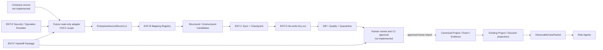
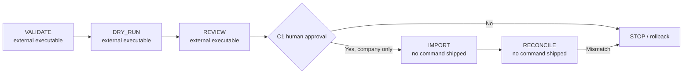

# ENT-A~F Enterprise Preparation 및 Handoff 상세 설계

> 문서 상태: Implemented Supporting Design v1.0
>
> 기준일: 2026-07-27
>
> 구현 기준 commit: `6a9889d` 이후 ENT-F 완료 상태
>
> 범위: fixture-only Enterprise Preparation과 사내 C0/C1 handoff 경계
>
> 현재 판정: `READY_FOR_INTERNAL_DISCOVERY`, live use 미승인
>
> Canonical authority: `docs/readiness/08_CANONICAL_TERMS_AND_API_CONTRACT.md`

## 1. 문서 목적

이 문서는 SoC 개발 Operational Ontology가 향후 사내 work-tracker와 knowledge-base의 실제
개발 정보를 받아들이기 위해 어떤 경계를 구현했는지 설명한다. 구현 보고서가 완료 항목과 검증
결과를 기록한다면, 이 문서는 다음을 설계 기준으로 고정한다.

- 외부 source record가 canonical Project/Decision truth가 되기 전 거치는 단계
- stable identity, version, 네 종류의 시간과 provenance 의미
- mapping candidate, sync checkpoint, dry-run diff, quarantine의 책임 분리
- ACL/classification, redaction, freshness, recovery와 audit의 fail-closed 규칙
- 사외에서 검증한 코드와 사내에서만 채울 수 있는 값의 ownership
- C0/C1에서 adapter를 추가할 때 지켜야 할 dependency와 승인 경계

이 문서는 제품별 API 사용법이나 회사 설정값을 정의하지 않는다. 특정 vendor, 실제 회사 field,
URL, Project ID, user/group, credential, ACL 값과 write-back은 현재 repository 범위 밖이다.

## 2. 설계 목표와 비목표

### 2.1 목표

1. 실제 source가 달라도 같은 source-neutral envelope로 검증한다.
2. raw source를 canonical truth로 직접 승격하지 않고 review candidate로 만든다.
3. 같은 입력과 checkpoint에서 같은 mapping/sync/dry-run 결과를 얻는다.
4. 데이터가 불완전하면 전체를 조용히 버리지 않고 명시적으로 격리한다.
5. ACL을 확인할 수 없거나 freshness가 불명확하면 fail-closed 한다.
6. 사외 준비 결과를 사내에서 재검증할 수 있는 versioned handoff package로 전달한다.
7. read-only pilot과 write-back을 별도 승인 단계로 분리한다.

### 2.2 비목표

- 실제 vendor SDK 또는 REST/GraphQL client
- authentication middleware와 회사 identity federation
- 실제 ACL 상속/평가와 secret manager 연동
- source polling service, durable enterprise queue 또는 scheduler
- canonical import service와 write-back
- Enterprise 전용 API/Frontend 화면
- 실제 사내 데이터 품질, 사용자 가치 또는 business value 입증

## 3. 현재 구현 범위

|Stage|구현 책임|주요 module|상태|
|---|---|---|---|
|ENT-A|source-neutral identity/time/access envelope|`enterprise_ingestion.py`, `ports.py`|구현 완료|
|ENT-B|versioned mapping과 provenance candidate|`enterprise_mapping.py`|구현 완료|
|ENT-C|deterministic sync/checkpoint/reconciliation|`enterprise_sync.py`|구현 완료|
|ENT-D|no-write diff, quality, quarantine/resolution|`enterprise_dry_run.py`|구현 완료|
|ENT-E|synthetic security/operation emulator|`enterprise_security_operations.py`|구현 완료|
|ENT-F|mapping/환경 template, pilot runbook, handoff manifest|`enterprise_handoff.py`|구현 완료|
|C0|실제 환경 discovery와 sanitized schema-fit|사내 전용 후속|미실행|
|C1|한 Project read-only pilot|사내 승인 후속|미실행|
|C2|controlled write-back|별도 ADR/승인 후속|금지|

## 4. 전체 아키텍처



가장 중요한 경계는 source에서 Frontend/Agent로 가는 직접 경로가 없다는 것이다.
`EnterpriseSourceRecord`와 mapping output은 staging/candidate이며 canonical truth가 아니다.
향후 승인된 import가 추가되더라도 기존 Project/Decision domain validation을 통과한 뒤에만
projection과 `ObservableCasePacket`의 입력이 될 수 있다.

## 5. Dependency와 실행 경계

### 5.1 Application-only Enterprise core

Enterprise module은 `backend/src/soc_ot/application/` 아래에 있으며 다음을 import하지 않는다.

- FastAPI와 API route
- SQLAlchemy와 infrastructure repository
- OpenAI/provider SDK
- vendor SDK/제품명
- Frontend label

`scripts/check-architecture-boundary.ps1`가 이 경계를 검사한다. 현재 구현은 YAML fixture를 읽어
순수한 Pydantic model과 deterministic function으로 처리한다.

### 5.2 Port 경계

`ports.py`는 미래 adapter를 위한 최소 protocol만 둔다.

```text
SourceReader.read(identity) -> EnterpriseSourceRecord | None
IngestionSink.write(record) -> None
```

이는 실제 adapter 구현이 아니다. C0에서 adapter가 추가될 때 application이 vendor client를
직접 import하지 않도록 하는 dependency inversion 지점이다. `IngestionSink.write`는 검증된
source envelope를 staging boundary로 전달하기 위한 이름이며 canonical import나 source
write-back authority가 아니다. 현재 CLI는 이 port를 사용해 외부 시스템에 접속하지 않는다.

### 5.3 Frontend/API 경계

ENT-A~F는 Enterprise API route나 UI를 만들지 않는다. 이유는 다음과 같다.

- source record와 mapping candidate는 사용자가 신뢰할 canonical object가 아니다.
- ACL이 실제로 평가되지 않은 상태에서 source content를 노출하면 안 된다.
- quality/quarantine review 전에 Project Situation이나 Risk로 표시하면 false truth가 된다.
- 기존 Frontend는 Backend projection을 표시하고 business rule을 계산하지 않는 원칙을 유지한다.

향후 UI가 필요하면 raw source explorer가 아니라 승인된 import의 provenance/freshness/quality를
기존 Project Situation/Risk Detail에 제한적으로 표시해야 한다.

## 6. ENT-A — Source-neutral ingestion contract

### 6.1 Stable identity

`EnterpriseSourceIdentity`는 네 필드의 tuple이다.

```text
(source_system, source_tenant, source_object_type, external_id)
```

- `source_system`: source adapter가 식별하는 논리 시스템
- `source_tenant`: 동일 시스템 내부의 조직/공간 경계
- `source_object_type`: project, work-item, issue, event, page와 같은 source object 종류
- `external_id`: source 안에서 안정적인 객체 ID

표시용 title, URL, 현재 상태를 identity로 쓰지 않는다. URL 변경은 identity 변경이 아니라 별도
quality/mapping 판단 대상이다.

### 6.2 Version과 content hash

- `external_version`: source가 제공하는 변경 version
- `content_hash`: 정규화된 source content의 SHA-256

같은 identity/version/hash는 idempotent하게 처리할 수 있다. 같은 version인데 hash가 다르면
version conflict이고, 새 version이지만 이전보다 오래된 update라면 out-of-order/stale 판단 대상이다.

### 6.3 네 종류의 시간

|필드|의미|사용 목적|
|---|---|---|
|`effective_at`|업무 세계에서 내용이 유효해진 시점|late arrival와 historical meaning|
|`observed_at`|source reader가 내용을 관측한 시점|관측 순서와 freshness|
|`source_updated_at`|source가 기록한 최종 갱신 시점|out-of-order/stale update|
|`ingested_at`|envelope가 PoC 경계에 들어온 시점|처리 지연과 audit|

모든 시간은 timezone 필수다. 로컬 simulation의 `at_step`과 이 시간들을 암묵적으로 변환하지
않는다. 실제 source의 time semantics는 C0 schema-fit에서 확인한다.

### 6.4 Content와 access metadata

```text
deletion_state = ACTIVE | DELETED | RESTRICTED
classification = PUBLIC | INTERNAL | CONFIDENTIAL | RESTRICTED
source_acl_ref  = opaque reference
```

`ACTIVE`만 payload를 가질 수 있다. `DELETED`와 `RESTRICTED`는 payload를 가지면 validation에
실패한다. `source_acl_ref`는 권한 승인 자체가 아니라 나중에 평가할 opaque reference다.
`source_url`에 username/password가 포함되면 거부한다.

## 7. ENT-B — Mapping과 candidate provenance

### 7.1 Mapping registry

`EnterpriseMappingRegistry`는 여러 `EnterpriseMappingProfile`을 version과 함께 보관한다.
Profile key는 `(source_system, source_object_type)`이고 하나만 존재해야 한다.

Profile은 다음을 고정한다.

- required source field
- source field → canonical target field
- source status → canonical status
- unstructured text → CLAIM/RISK/ASSUMPTION 추출 rule
- late-arrival threshold

### 7.2 Candidate 종류

```text
StructuredCandidateKind =
  PROJECT | WORK_ITEM | ISSUE | EVIDENCE | EVENT

UnstructuredCandidateKind =
  CLAIM | RISK | ASSUMPTION
```

Structured candidate는 source identity, external version, mapping profile/version, mapped values,
JSON pointer 기반 source span을 보존한다. Unstructured candidate도 source field와 span,
extractor version, `UNREVIEWED` 상태를 가진다.

### 7.3 Disposition

```text
MappingDisposition = ACCEPT | QUARANTINE | REJECT
```

- `ACCEPT`: schema와 mapping이 완전한 review candidate
- `QUARANTINE`: 사람이 검토하거나 source/mapping을 수정해야 하는 상태
- `REJECT`: 안전하게 candidate를 만들 수 없는 상태

결과는 reason code를 동반한다. 예: profile 없음, required field 누락, status 미매핑,
duplicate/conflicting version, out-of-order update, URL 변경, 삭제/제한, late arrival.

중요한 원칙은 `ACCEPT`도 canonical import 승인이 아니라는 것이다.

## 8. ENT-C — Deterministic sync와 reconciliation

### 8.1 Page와 checkpoint

Sync input은 연속된 `page_index`, `page_token`, `cursor_value`, record 목록으로 구성된다.
Checkpoint는 다음을 저장하는 value object다.

- 다음 page index/token과 cursor
- identity별 current external version/content hash/time/deletion state
- current mapping result와 mapping revision
- 이미 본 version → hash
- ordered Event identity
- record audit와 retry audit

현재 checkpoint는 fixture/in-memory contract이며 DB persistence는 구현하지 않았다.

### 8.2 Idempotency와 stale protection

Record reconciliation은 identity/version/hash를 비교해 다음 disposition을 낸다.

```text
APPLIED | NO_CHANGE | QUARANTINED | REJECTED
```

같은 content는 `NO_CHANGE`, 오래된 source update는 현재 상태를 덮어쓰지 않는다.
Tombstone과 access restriction은 payload 없이 현재 reconciliation state에 반영된다.
Event 순서는 reconciled state에서 다시 계산되며 duplicate identity를 허용하지 않는다.

### 8.3 Retry와 resume

`EnterpriseSyncPolicy`는 page당 최대 시도와 backoff 목록을 제한한다. 일시 실패는 retry audit을
남기고, 소진하면 failed page를 명시한다. Checkpoint로 중단 지점부터 resume했을 때 one-shot
결과와 동일해야 한다.

현재 retry는 synthetic failure simulation이며 실제 network retry가 아니다.

## 9. ENT-D — No-write dry-run과 review artifact

### 9.1 Input

`EnterpriseDryRunInput`은 다음을 포함한다.

- timezone이 있는 `as_of`와 stale threshold
- known ACL reference 목록
- canonical snapshot version과 object snapshot
- candidate kind별 canonical key rule
- quality probe

`EnterpriseResolutionFile`은 quarantine ID와 expected content hash, reviewer, justification,
proposed action/time을 담는다. 이것도 실행 명령이 아니라 review proposal이다.

### 9.2 Canonical diff proposal

```text
CanonicalChangeAction = CREATE | UPDATE | DELETE | NO_CHANGE
```

Change는 before/after values와 source identity/reason을 포함하지만 실제 DB를 바꾸지 않는다.
Report의 다음 필드는 literal false라서 true를 주장할 수 없다.

```text
write_performed = false
canonical_import_authorized = false
```

### 9.3 Quality와 quarantine

```text
EnterpriseQualityCode =
  DANGLING_REFERENCE
  TIME_AMBIGUITY
  UNMAPPED_FIELD
  ACL_REFERENCE_UNKNOWN
  STALE_SOURCE
  MAPPING_QUARANTINED
  MAPPING_REJECTED
```

Finding은 severity와 `blocks_import`를 가진다. Blocking finding은 quarantine entry로 연결되고
상태는 `OPEN` 또는 `RESOLUTION_PROPOSED`다. Resolution proposal이 있어도 자동 import되지 않는다.

Summary는 mapping coverage, create/update/delete/no-change, finding/reject/quarantine,
open/proposed resolution과 freshness를 별도 수치로 제공한다. 하나의 오류 때문에 다른 source를
조용히 버리지 않는다.

## 10. ENT-E — Security와 operation emulator

### 10.1 Exposure policy

Exposure surface:

```text
FRONTEND | API | MODEL | ROLE_PACKET | LOG
```

Exposure mode:

```text
FULL | METADATA_ONLY | DENY
```

모든 classification은 모든 surface에 대한 rule을 가져야 한다. 평가 순서는 restricted/inactive,
classification denial, unknown principal, missing ACL, explicit/conflicting deny, no allow match,
allow 순이다. Missing/unknown/conflict는 모두 deny다.

`RESTRICTED`는 모든 surface에서 거부한다. Report는 raw restricted identity/URL/payload 대신
SHA-256 reference만 사용한다.

### 10.2 Redaction과 audit

Untrusted message/header/nested JSON에서 설정된 sensitive field, bearer/token/password/secret,
API key와 URL user-info를 재귀적으로 `[REDACTED]` 처리한다. Audit는 event type, time, hashed
subject와 compact outcome만 가진다.

Report는 다음을 바꿀 수 없다.

```text
real_authorization_performed = false
credential_persisted = false
```

따라서 synthetic `ALLOW`는 실제 회사 access grant가 아니다.

### 10.3 Freshness와 recovery

```text
Incident =
  HEALTHY | LAG | STALE | RATE_LIMITED | PARTIAL_SOURCE | UNKNOWN_FRESHNESS

Readiness = READY | NOT_READY

Recovery =
  NONE | WAIT_BACKOFF | FULL_RECONCILIATION |
  RETRY_MISSING_PARTITION | ESCALATE_SOURCE_OWNER
```

완전하고 known-freshness이며 lag threshold 안의 HEALTHY만 current/READY다. Unknown freshness는
절대 current가 아니다. Metrics와 audit event는 deterministic output contract이며 production
monitoring service는 아니다.

## 11. ENT-F — Machine-validatable handoff

### 11.1 Package 구조

```text
fixtures/enterprise/handoff/
├─ work-tracker-mapping-template.v1.yaml
├─ knowledge-base-mapping-template.v1.yaml
├─ environment-worksheet.v1.yaml
├─ pilot-runbook.v1.yaml
└─ handoff-package.v1.yaml
```

`handoff-package.v1.yaml`은 네 child artifact의 SHA-256을 고정한다. 상위
`fixtures/enterprise/manifest.yaml`은 package를 포함한 다섯 파일을 다시 고정한다.

### 11.2 Mapping template

Work-tracker template은 PROJECT/WORK_ITEM/ISSUE/EVENT를, knowledge-base template은 EVIDENCE를
포함한다. Canonical target field/status만 제공하고 다음은 literal `INTERNAL_REQUIRED`다.

- 실제 source system
- mapping version
- source field
- source status

따라서 template가 company field를 추측하거나 fixture 값을 실제 설정처럼 제시하지 않는다.

### 11.3 Environment worksheet

Worksheet는 다음 11개 topic을 누락할 수 없다.

1. deployment/version
2. network/proxy/certificate
3. identity/access method
4. secret-manager reference
5. ACL/classification
6. retention/deletion
7. rate limit
8. data owner
9. security owner
10. human decision authority
11. model provider policy

현재 package의 internal item은 value/evidence가 null이고 `UNCONFIRMED_INTERNAL`이어야 한다.
Identity/access와 secret reference는 `must_not_commit_value=true`다. 실제 credential을 이
worksheet에 넣는 것이 아니라 사내 승인된 secret mechanism을 별도로 확인한다.

### 11.4 외부/내부 ownership

```text
EXTERNALLY_VERIFIED + VERIFIED_EXTERNALLY + evidence_ref
INTERNAL_REQUIRED   + UNCONFIRMED_INTERNAL + no evidence_ref
```

첫 그룹은 ENT-A~E ADR과 test evidence다. 두 번째는 환경, 실제 mapping, 한 Project allowlist와
사람 승인이다. 두 ownership을 혼합하거나 내부 미확인 값을 외부 검증 완료로 표시할 수 없다.

### 11.5 Pilot와 고정 runbook

```text
max_project_count = 1
read_only = true
write_back_enabled = false
canonical_import_authorized = false
live_use_authorized = false
```



Stage는 정확히 다섯 개이며 순서를 바꿀 수 없다. VALIDATE/DRY_RUN/REVIEW만 local command가
있다. IMPORT/RECONCILE은 `COMPANY_APPROVAL_REQUIRED`이고 command가 존재하면 validation 실패다.

Expected metrics는 ACL exposure, credential leak, write attempt, silent drop, duplicate Event,
reconciliation mismatch이며 목표는 모두 0이다. 실제 사내 관측 전 상태는 `NOT_EVALUATED`다.

## 12. CLI와 데이터 흐름

### 12.1 Source/fixture validation

```powershell
uv run soc-ot enterprise validate-source
```

Mapping registry, dirty corpus, sync pages, dry-run input와 resolution file schema를 검증한다.
Canonical write는 수행하지 않는다.

### 12.2 No-write dry-run

```powershell
uv run soc-ot enterprise dry-run `
  --output output/enterprise-dry-run.json
```

In-memory full reconciliation 후 diff/quality/quarantine report만 지정 경로에 쓴다. Runtime
database를 열거나 canonical object를 변경하지 않는다.

### 12.3 Security/operation review

```powershell
uv run soc-ot enterprise emulate-security `
  --output output/enterprise-security.json
```

Synthetic policy/scenario를 평가해 redacted report만 쓴다. 실제 authorization이나 credential
persistence를 수행하지 않는다.

### 12.4 Handoff validation

```powershell
uv run soc-ot enterprise validate-handoff
```

Package/child hash, schema, 두 source kind, worksheet와 runbook을 검증한다. Database/network를
열거나 output을 쓰지 않는다.

## 13. 실패 모드와 중단 기준

|실패 모드|탐지 지점|기본 행동|
|---|---|---|
|source identity/version 의미 불명확|ENT-A/C0 schema-fit|STOP, mapping 금지|
|timezone 없음/시간 의미 충돌|ENT-A/ENT-D|reject 또는 quarantine|
|required field/status 미매핑|ENT-B|quarantine/reject|
|같은 version의 다른 hash|ENT-B/ENT-C|conflict, 현재 상태 보호|
|out-of-order/stale update|ENT-B/ENT-C|현재 상태 덮어쓰기 금지|
|page retry 소진|ENT-C|FAILED와 failed page 기록|
|dangling/unmapped/unknown ACL|ENT-D|blocking finding/quarantine|
|restricted/unknown ACL exposure|ENT-E|DENY|
|credential-like diagnostic|ENT-E|redact 후 metadata audit|
|unknown freshness|ENT-E|NOT_READY, current=false|
|handoff child 변조|ENT-F|hash mismatch, STOP|
|내부 value가 외부 package에 입력됨|ENT-F|schema rejection|
|Project allowlist가 2개 이상|ENT-F|schema rejection|
|Import command가 C1 전에 추가됨|ENT-F|schema rejection|
|silent drop/duplicate/reconcile mismatch|C1|rollback, canonical update 금지|

## 14. C0/C1 확장 설계

### 14.1 C0 discovery 산출물

C0는 코드를 먼저 쓰는 단계가 아니라 다음을 확인하는 단계다.

- 실제 deployment/version과 허용 source API
- stable identity와 external version 의미
- 네 시간 필드의 source semantics와 timezone
- page/cursor/rate-limit/retry behavior
- source ACL, classification, deletion과 retention
- network/proxy/certificate와 승인된 secret mechanism
- data/security owner, human decision authority와 model provider policy
- 한 Project sanitized sample의 schema-fit

실제 값과 export는 승인된 사내 저장 위치에서 관리하며 이 repository나 Git history에 넣지 않는다.

### 14.2 Future adapter shape

향후 adapter는 별도 infrastructure module에서 다음 순서로 작동해야 한다.

```text
vendor DTO
  → normalize/validate
  → EnterpriseSourceRecord.v1
  → application mapping/sync/dry-run
```

Adapter는 canonical Project/Event를 직접 생성하지 않는다. Source API error나 partial page를
숨기지 않고 page/retry/freshness metadata로 전달한다. Credential은 process memory와 승인된
secret mechanism 밖에 저장하지 않으며 log/report/exception에 포함하지 않는다.

### 14.3 C1 read-only pilot

C1 최소 조건:

1. 승인된 Project 하나가 allowlist에 있음
2. source ACL과 exposed surface policy가 실제 principal/group 기준으로 검증됨
3. sanitized dry-run의 blocking quarantine가 0이거나 명시적으로 중단됨
4. rollback owner와 source access 철회 절차가 있음
5. import가 필요하면 별도 ADR, audit, idempotency와 human approval이 있음
6. import 후 source/candidate/canonical count와 identity/version을 독립 reconcile함

C1에서도 write-back은 없다. C2는 별도 제품/보안/운영 결정이다.

## 15. 보안과 데이터 취급

### 15.1 Repository에 허용

- synthetic fixture와 `.invalid` URL
- opaque synthetic ACL reference
- canonical status/field template
- null `INTERNAL_REQUIRED` worksheet
- hashed fixture manifest
- redacted synthetic report

### 15.2 Repository에 금지

- 회사 export, 실제 Project/Space ID와 URL
- 실제 user/group/principal/ACL
- token, password, cookie, API key, certificate private key
- 실제 secret value 또는 복호화 가능한 credential
- 승인되지 않은 source content와 attachment
- live import/write-back command

`scripts/check-secrets.ps1`는 마지막 방어선이지 실제 값 입력 허가가 아니다. 발견 즉시 commit을
중단하고 working tree 밖의 승인된 위치로 이동해야 한다.

## 16. Contract와 변경 관리

### 16.1 Source of truth

우선순위:

1. `docs/readiness/08_CANONICAL_TERMS_AND_API_CONTRACT.md`
2. ADR-0012~ADR-0017
3. generated JSON Schema
4. application Pydantic model
5. fixture와 이 supporting design

실제 코드와 이 문서가 다르면 문서만 고쳐 합리화하지 않는다. Canonical contract/ADR 변경 여부를
먼저 판단하고 schema, fixture, test, runbook과 plan을 함께 갱신한다.

### 16.2 Version 변경이 필요한 경우

- identity/time 의미 변경
- enum/state/reason code 변경
- source/canonical ownership 변경
- ACL/classification exposure 의미 변경
- write/import authority 변경
- handoff stage 또는 pass/stop criteria 변경

이 경우 새 schema version 또는 accepted ADR이 필요하다. 실제 vendor adapter를 넣을 때도 기존
Enterprise core에 제품 분기를 넣지 않고 별도 adapter와 contract test를 추가한다.

## 17. 테스트와 추적성

|Stage test|검증 책임|
|---|---|
|`test_ent_a_enterprise_source_contract.py`|identity/time/content/access envelope와 port boundary|
|`test_ent_b_mapping_registry.py`|mapping coverage, dirty patterns, provenance/disposition|
|`test_ent_c_enterprise_sync.py`|idempotency, retry/resume, tombstone, reconciliation|
|`test_ent_d_enterprise_dry_run.py`|diff, quality, quarantine, no-write CLI|
|`test_ent_e_security_operations.py`|fail-closed ACL, redaction, freshness/recovery/audit|
|`test_ent_f_enterprise_handoff.py`|template, worksheet, pilot, hash, authority와 CLI|

필수 repository Gate:

```powershell
uv run ruff check backend/src backend/tests
uv run mypy backend/src
uv run pytest -m "not postgres" -p no:cacheprovider
powershell -File scripts/check-plan-consistency.ps1
powershell -File scripts/check-architecture-boundary.ps1
powershell -File scripts/check-hidden-boundary.ps1
powershell -File scripts/check-secrets.ps1
powershell -File scripts/check-generated-contracts.ps1
```

2026-07-27 ENT-F 완료 기준은 12개 focused test와 240개 non-PostgreSQL test가 통과했다.

## 18. 현재 한계와 올바른 해석

|현재 결과|말할 수 있는 것|말할 수 없는 것|
|---|---|---|
|ENT-A contract PASS|envelope validation 규칙이 구현됨|실제 source schema가 맞음|
|ENT-B fixture PASS|mapping/provenance behavior가 결정적임|회사 field mapping이 완성됨|
|ENT-C fixture PASS|sync/retry/reconcile 알고리즘 계약이 검증됨|production polling이 안정적임|
|ENT-D dry-run PASS|no-write diff/quality/quarantine가 동작함|실제 data 품질이 충분함|
|ENT-E emulator PASS|synthetic fail-closed/redaction/recovery가 동작함|실제 authorization이 승인됨|
|ENT-F handoff PASS|사내 discovery 절차와 경계가 준비됨|live pilot 준비가 완료됨|

`READY_FOR_INTERNAL_DISCOVERY`는 “사내에서 확인할 질문과 안전 경계가 준비됐다”는 뜻이다.
“실제 connector를 바로 켤 수 있다”거나 “business value가 입증됐다”는 뜻이 아니다.

## 19. 설계 완료 판정

ENT-A~F는 source부터 handoff까지 다음 불변 원칙을 구현한다.

1. raw source는 truth가 아니라 검증 대상이다.
2. mapping 결과는 review candidate이지 자동 결정이 아니다.
3. 일부 실패를 숨기지 않고 quarantine와 freshness로 드러낸다.
4. 권한과 최신성을 모르면 노출하거나 current로 표시하지 않는다.
5. 실제 승인 없는 import/write-back 실행 경로를 만들지 않는다.
6. Agent와 Frontend는 검토되지 않은 Enterprise source를 직접 보지 않는다.
7. 사외 검증과 사내 확인 책임을 명시적으로 분리한다.

따라서 현재 설계 상태는 **사외 Enterprise Preparation 완료 / 사내 C0 discovery 준비 완료 /
live use와 write-back NO-GO**다.
